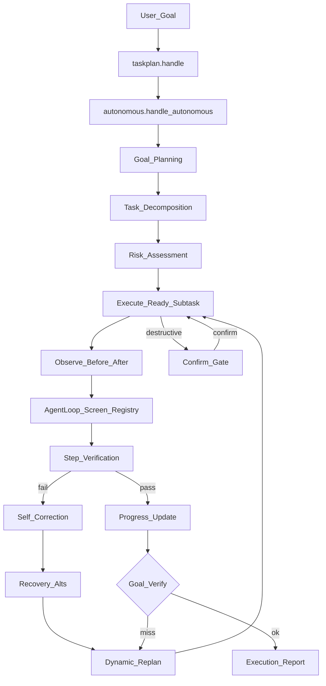

# Autonomous Agent — Report

Date: 2026-07-30  
Constraints honored: **FastIntentRouter**, **Screen Understanding**, **Computer Use cores**, **Plugin SDK**, **Workflow Recording**, **Memory**, and **Learning Engine** were **not rewritten**. Task Planner remains the bridge entry; this upgrade adds an autonomous execution engine that composes existing recover / safety / observe paths.

## 1. Goal

Upgrade Task Planner into a **fully autonomous execution engine** supporting:

| Capability | Implementation |
|------------|----------------|
| Goal Planning | `plan_goal` → `extract_goal` + criteria |
| Task Decomposition | Existing `build_graph` (templates / multi_app / generic) |
| Dynamic Planning | `replan.replan_remaining` + recovery node insert |
| Self Correction | `correct.diagnose` + `suggest_corrections` |
| Recovery | Deterministic recovery + focus/screen ladders |
| Verification | Step soft-verify + goal criteria verify |
| Progress Tracking | `progress.snapshot` / `step_table` |
| Risk Assessment | `risk.assess_plan` / `assess_action` |
| Confirm before destructive | `risk.must_confirm` + `WAITING_CONFIRM` |

## 2. Architecture



**Routing:** `agent.run` → `maybe_handle_taskplan` → `taskplan.handle` → **`handle_autonomous`** (when `agent.autonomous_execution` is true; classic `run_graph` remains as fallback).

## 3. Package layout

`backend/neuron/autonomous/`

| Module | Role |
|--------|------|
| `engine.py` | `plan_goal`, `run_autonomous`, `handle_autonomous`, tools |
| `risk.py` | Action/plan risk + confirm gate |
| `verify.py` | Step + goal verification |
| `correct.py` | Failure diagnosis + correction suggestions |
| `replan.py` | Dynamic insert / swap / skip |
| `progress.py` | Progress % and step table |

Composes (does not fork): `taskplan.decompose`, `taskplan.observe`, `taskplan.state`, `engine._execute_subtask`, `brain.recover`, `safety.levels.classify`.

## 4. Tools

| Tool | Risk | Purpose |
|------|------|---------|
| `autonomous_run` | confirm | Plan + execute autonomously |
| `autonomous_assess` | safe | Plan + risk only (no side effects) |
| `autonomous_progress` | safe | Live progress / confirm state |
| `run_task_workflow` | safe | Existing entry (now routes through autonomous handle) |

## 5. Confirmation before destructive actions

Before each subtask:

1. `risk.assess_plan` marks destructive tools (`task_zip_folder`, `task_move_files`, install-like goals, policy CONFIRM/HIGH/BLOCKED)  
2. `must_confirm` pauses with `TaskStatus.WAITING_CONFIRM`  
3. User says **confirm** → resume with `confirmed=True`  
4. **cancel** clears the run  

## 6. Config

```json
"agent": {
  "task_planning_engine": true,
  "autonomous_execution": true
}
```

Set `autonomous_execution: false` to use classic `run_graph` only.

## 7. Bench

```bash
cd backend
python tests/run_autonomous_bench.py
```

Covers planning, risk, verify, correction, dynamic replan, progress, confirm gate, tool registration, non-workflow passthrough.

Also keep: `python tests/run_taskplan_bench.py` (decomposition unchanged).

## 8. Report fields (execution meta)

Autonomous runs attach to `meta.report`:

- `risk`, `corrections`, `dynamic_replans`  
- `verifications[]`, `goal_verify`  
- `progress` (`progress_pct`, current step, apps)

## 9. Non-goals

- Does not replace Computer Use for unknown UI goals  
- Does not bypass FastIntent Category A single commands  
- Does not invent a second AgentLoop — still executes subtasks via existing `_execute_subtask`  
- LLM mid-run replan remains optional future work; current dynamic planning is deterministic
