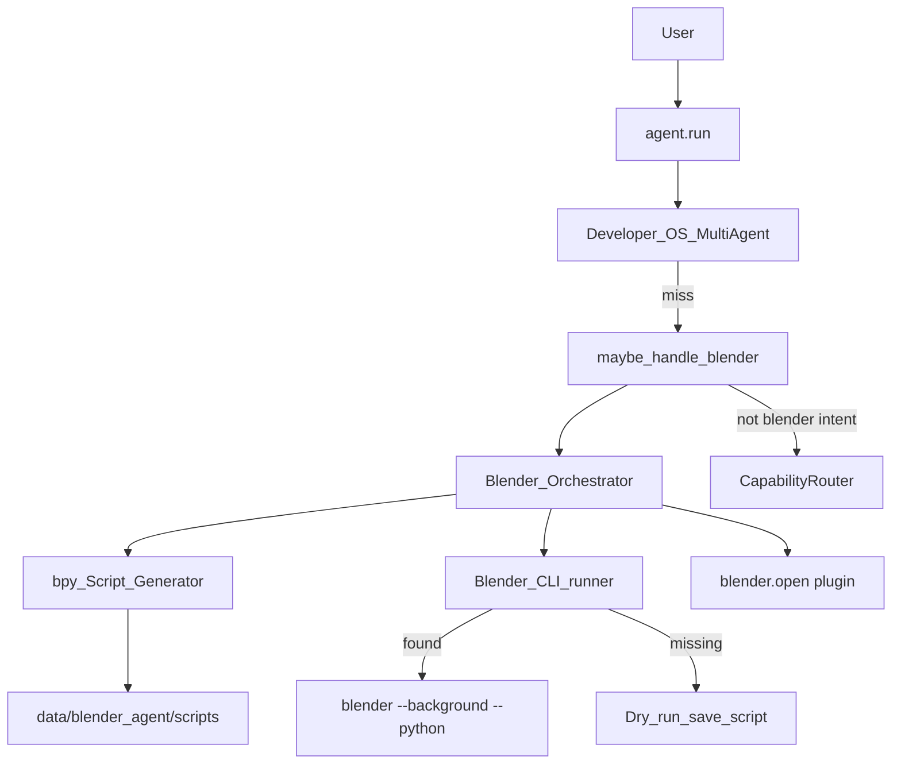

# Blender Agent — Report

Date: 2026-07-30  
Constraints honored: existing NEURON cores and the builtin Blender **plugin** were **not rewritten**. This agent composes `blender.open` / `open_app` and drives Blender through generated **bpy** scripts (`blender --background --python …`).

## 1. Goal

Make NEURON a **Blender AI expert** that can:

| Capability | bpy approach |
|------------|----------------|
| Create objects | Primitives + recipes (e.g. realistic soda can) |
| Import / export models | OBJ / FBX / GLTF / STL / blend |
| Generate materials | Principled BSDF + noise procedural graphs |
| Geometry nodes | Modifier + GeometryNodeTree scaffold |
| Rigging | Armature + automatic weights |
| Animation | Location/rotation keyframes |
| Lighting | Three-point AREA lights + world |
| Rendering | Cycles / Eevee stills |
| Physics | Rigid body ground + active body |
| Camera setup | Lens + Track To |
| Texture generation | Procedural noise → color ramp |
| Asset management | `backend/data/blender_agent/` library |
| Fix topology | Merge by distance, normals, optional remesh |

Example utterances: “Create a realistic soda can.” · “Animate this character.” · “Render in Cycles.” · “Fix topology.” · “Generate a procedural material.”

## 2. Architecture



## 3. Package

`backend/neuron/blender_agent/`

| Module | Role |
|--------|------|
| `scripts_gen.py` | bpy source generators |
| `runner.py` | Find Blender, write/run scripts, asset dirs |
| `detect.py` | Intent detect/classify |
| `orchestrator.py` | Capability dispatch |
| `bridge.py` | `maybe_handle_blender` |
| `types.py` | `BlenderCapability`, `BlenderResult` |

## 4. Blender Python API

All scene work is expressed as **generated bpy scripts**, not a fork of Blender. Typical pattern:

```python
import bpy
# ... create / shade / animate ...
bpy.ops.wm.save_as_mainfile(filepath=...)
# or bpy.ops.render.render(write_still=True)
```

Execution:

```text
blender --background --python <generated_script.py>
```

If Blender is not installed, scripts are still written (dry-run) under `backend/data/blender_agent/scripts/`.

## 5. Tools

| Tool | Risk | Purpose |
|------|------|---------|
| `blender_status` | safe | CLI detect + asset counts |
| `blender_run` | confirm | Natural-language / capability dispatch |
| `blender_script` | confirm | Custom bpy source |

Config:

```json
"agent": { "blender_agent": true },
"blender_agent": { "blender_path": "", "background": true }
```

## 6. Bench

```bash
cd backend
python tests/run_blender_agent_bench.py
```

Covers detect/classify, all major script generators, dry-run soda can/material/render, bridge non-steal, tool registration, plugin compose.

## 7. Non-goals

- Does not modify FastIntent, Task Planner, Computer Use, Developer Mode, or the existing Blender plugin package  
- Does not embed a full node-UI editor — geo nodes are scaffolds you refine in Blender  
- GPU Cycles requires a working Blender install with GPU devices configured  
- Interactive viewport sculpting remains better suited to Computer Use / Screen Understanding when the GUI is already open
