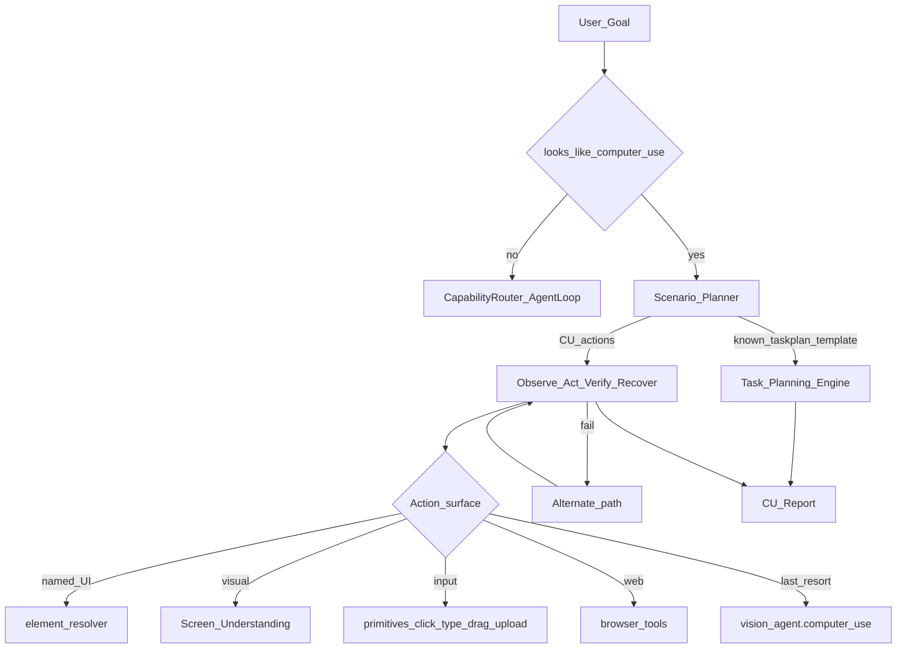

# Computer Use Agent — Report

Date: 2026-08-01  
Constraints honored: previous systems were **not rewritten**. Composes Screen Understanding, Task Planning, FastIntentRouter (via tools), Vision, and OCR.

## 1. Goal

Allow NEURON to operate **any Windows application** as a Computer Use Agent:

- Understand screen layout  
- Move mouse intelligently  
- Click UI elements  
- Type text  
- Drag / drop  
- Scroll  
- Detect failures  
- Recover automatically  

Supported goals include: book a train ticket, download Blender, fill a form, upload a file, open Discord and send a message, navigate Settings.

## 2. Architecture



**Policy order:** ToolRegistry / UIA resolver → Screen Understanding → primitives (mouse/keyboard/drag/upload) → `vision_agent.computer_use`.

## 3. Capabilities

| Capability | How |
|------------|-----|
| Any Windows app | `open_app` + screen/vision grounding |
| Screen layout | `neuron.screen.observe` (OCR + UIA) |
| Smart mouse | `move_to` / resolver centers / vision clicks |
| Click UI | `element_resolver` + `screen_understand` |
| Type | `input_ops.type_text` / `type_text` tool |
| Drag/drop | **New** `drag_drop` primitive (pyautogui) |
| Scroll | existing scroll tools |
| Upload file | **New** `upload_file` (Open dialog path + Enter) |
| Failure detect | execute ok + soft observe verify |
| Auto recover | screen↔vision↔focus_app alternates (max 3) |
| User approval | confirm gate before vision / type / upload |

## 4. Scenario recipes

| Goal | Path |
|------|------|
| Book a train ticket | IRCTC site → screen Login/From → vision assist (confirm) |
| Download Blender | **Delegates to Task Planning** template when available; else Chrome → blender.org → Download |
| Fill this form | Screen field discovery → vision fill (confirm) |
| Upload this file | Click Upload → `upload_file` path or vision dialog |
| Open Discord + send message | open Discord → focus compose → type → Enter |
| Navigate settings | `open_settings(page)` → screen navigate |

## 5. Files

| File | Change |
|------|--------|
| `backend/neuron/computer_use/` | **New package** — detect, scenarios, primitives, observe, act, agent, bridge |
| `backend/neuron/brain/agent.py` | Hook after Task Planning, before CapabilityRouter |
| `backend/neuron/brain/tool_registry.py` | Register `computer_use_agent`, `drag_drop`, `upload_file` |
| `backend/config.json` | `agent.computer_use_agent: true` |
| `backend/tests/run_computer_use_bench.py` | Detect / plan / graph / drag benches |
| This report | Documentation |

**Untouched:** `fast_router.py`, `understand/*`, `screen/*`, `taskplan/*`, `streaming_voice/*`, latency/`perf`.

## 6. Benchmarks

| Metric | Result |
|--------|--------|
| Detect accuracy (7 samples) | **100%** |
| Non-CU skip (mute/volume/open/undo) | **100%** |
| Plan accuracy | **100%** |
| TaskGraph conversion | **OK** |
| Observe | **~277 ms** |
| Drag self-noop | **OK** |
| Mean planner latency | **~1.1 ms** |
| Prior packages untouched | **PASS** |

Regression: Task Planning, FastIntentRouter, V4 unit tests — **PASS**.

## 7. Runtime report fields

`meta.report` includes: status, success, steps_ok/failed, recoveries, retries, planner_ms, execution_ms, action history, observations.

## 8. Future recommendations

1. Playwright `set_input_files` for browser uploads (faster than OS dialog).  
2. Explicit download-complete waiter for Blender/installer flows.  
3. Form schema extraction (UIA labels → typed field map) before vision.  
4. Interactive success-rate harness per scenario.  
5. Coordinate drag from Screen Understanding element pairs (source/target names).

## 9. How to run

```bash
cd backend
python tests/run_computer_use_bench.py
python tests/run_taskplan_bench.py
python tests/run_fast_router_bench.py
```

Config: `agent.computer_use_agent: true`. Vision/upload steps ask for **confirm**.
