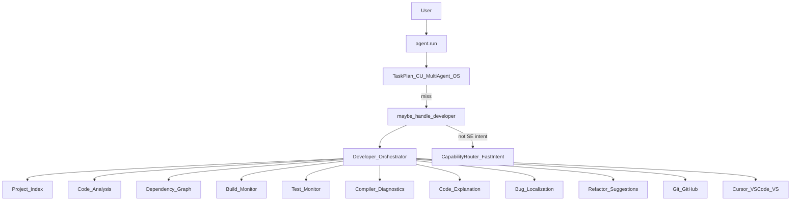

# Developer Mode — Report

Date: 2026-07-30  
Constraints honored: **FastIntentRouter**, **Streaming Voice**, **Semantic Understanding**, **Screen Understanding**, **Task Planner**, **Memory**, and **Computer Use** were **not modified**. Developer Mode is a compose-only layer that reuses plugins (VS Code / Cursor), file tools, git CLI, and optional IDE open via the tool registry.

## 1. Goal

Make NEURON an **AI software engineer** that understands development workflows, for example:

- Create a React app  
- Fix this compile error  
- Review my latest commit  
- Run the unit tests  
- Explain this stack trace  
- Generate documentation  
- Refactor this class  
- Find the bug  
- Optimize this code  

## 2. Supported ecosystems

| Area | Support |
|------|---------|
| IDEs | Cursor, VS Code, Visual Studio (open/focus via plugins / `open_app`) |
| Terminal / Git / GitHub | git status/log/diff/show + remote URLs |
| Docker | Dockerfile / compose detection; docker build suggestions |
| Languages | Node/TS/JS, Python, C++, Rust, Java, C# (+ React, Electron frameworks) |

## 3. Architecture



**Rule:** Never steal Category A FastIntent (`mute`, bare `Open Chrome`, …).

## 4. Implemented capabilities

| Capability | Module | Behavior |
|------------|--------|----------|
| Code analysis | `analyze.py` | Languages, frameworks, summary |
| Repository understanding | `index.py` | Walk + manifests + entrypoints |
| Project indexing | `index.py` | Cached `ProjectIndex` |
| Dependency graph | `deps.py` | package.json / requirements / pyproject / Cargo |
| Build monitoring | `build_test.py` | Detect cmds; execute only when confirmed |
| Test monitoring | `build_test.py` | Detect + optional monitored run |
| Compiler diagnostics | `analyze.parse_diagnostics` | Python, tsc, Rust, MSVC, Java |
| Code explanation | `explain_code_or_trace` | Structured narrative |
| Bug localization | `localize_bug` | Ranked file:line suspects |
| Refactoring suggestions | `refactor.py` | Stack-aware tips |
| Scaffold / docs | `scaffold_plan` / `docs_outline` | React/Electron/Python/Rust plans |

## 5. Package

`backend/neuron/developer/`

| File | Role |
|------|------|
| `bridge.py` | `maybe_handle_developer` |
| `detect.py` | SE intent detect/classify |
| `orchestrator.py` | Central dispatcher |
| `index.py` / `deps.py` / `git_ops.py` | Repo intelligence |
| `analyze.py` / `build_test.py` / `refactor.py` | Engineering assists |
| `types.py` | `DevCapability`, `DevResult`, `ProjectIndex` |

## 6. Tools

| Tool | Risk | Purpose |
|------|------|---------|
| `developer_status` | safe | Mode + project summary |
| `developer_run` | confirm | Full orchestrator / capability dispatch |
| `developer_index` | safe | Index repository |
| `developer_review` | safe | Latest commit review |

## 7. Config

```json
"agent": {
  "developer_mode": true
}
```

## 8. Bench

```bash
cd backend
python tests/run_developer_bench.py
```

## 9. Composition (reuse, don’t rewrite)

| Need | Reused surface |
|------|----------------|
| Open IDE | `cursor.open` / `vscode.open` / `open_app` |
| Multi-step installs | User can escalate to Task Planner / Autonomous (unchanged) |
| Screen/Problems panel | Screen Understanding / Computer Use still available on other paths |
| Memory of prefs | Memory engine unchanged; Developer Mode returns structured data |

## 10. Non-goals

- Does not replace Cursor/VS Code language servers  
- Does not auto-execute builds/tests without confirm/`execute`  
- Does not modify FastIntent, voice, semantic, screen, taskplan, memory, or computer-use cores  
- Deep AI refactors remain suggestions unless a later confirmed write path is added
