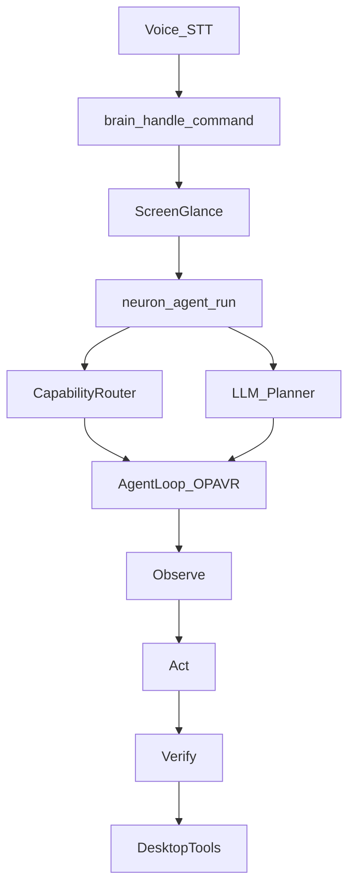
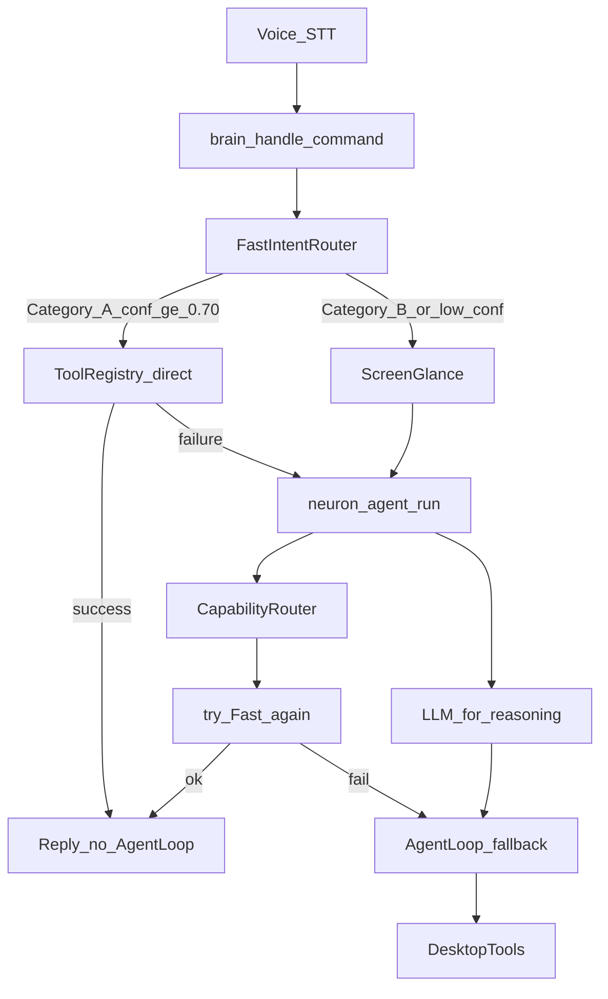

# Fast Intent Router — Architecture Report

Date: 2026-08-01  
Change type: Routing only (AgentLoop preserved for Category B + fallback).

## 1. Old vs new flow

### Before



### After



## 2. Files modified

| File | Why |
|------|-----|
| [`backend/neuron/brain/fast_router.py`](../neuron/brain/fast_router.py) | **New** — Category A/B classify, confidence bands, direct tool exec |
| [`backend/brain.py`](../brain.py) | Call FastIntentRouter before glance/AgentLoop |
| [`backend/neuron/brain/agent.py`](../neuron/brain/agent.py) | Capability/recipe paths prefer fast exec; AgentLoop on fallback |
| [`backend/actions.py`](../actions.py) | `unmute` maps to mute key (toggle) |
| [`backend/config.json`](../config.json) | `agent.fast_desktop_router: true` |
| [`backend/tests/run_fast_router_bench.py`](../tests/run_fast_router_bench.py) | **New** — latency + `used_agent_loop=False` assertions |
| [`backend/tests/fast_router_bench_report.json`](../tests/fast_router_bench_report.json) | Measured results |
| This report | Step 7 deliverable |

## 3. Confidence bands

| Band | Confidence | Behavior |
|------|------------|----------|
| immediate | ≥ 0.95 | Execute tools now |
| light | 0.70–0.95 | Resolve/validate args, then execute |
| agent | &lt; 0.70 or Category B | AgentLoop / LLM |

## 4. Latency (measured)

From `tests/run_fast_router_bench.py --compare-agent`:

| Path | mean | median | p95 | worst |
|------|------|--------|-----|-------|
| **FastIntentRouter** | **119 ms** | **42 ms** | 337 ms | 337 ms |
| Forced AgentLoop (old) | 723 ms | 649 ms | 890 ms | 890 ms |
| brain.handle_command (volume) | 181 ms | 237 ms | 242 ms | 242 ms |

Examples:
- mute fast: **42 ms**, AgentLoop: **649 ms** (~15×)
- volume up fast: **~210–337 ms**, AgentLoop: **~890 ms**
- open chrome (already running): **~957 ms**, `used_agent_loop=False`

**Assertion:** all SAFE Category A samples reported `used_agent_loop=False` — **PASS**.

## 5. Preserved

- AgentLoop for ambiguous/multi-step/LLM tasks  
- Browser, mouse, keyboard, windows, OCR, vision, memory  
- Fast-path failure → automatic AgentLoop fallback  
- Safety/policy still applied via `tool_registry.execute`  

## 6. Remaining bottlenecks

1. First call may pay ToolRegistry bootstrap (~100–300 ms)  
2. `open_app` / `focus_app` still wait on Win32/UIA (hundreds of ms–seconds) even without AgentLoop  
3. Category B and clicks still use full OPAVR  
4. STT/VAD latency is outside this routing change  

## 7. Future recommendations

1. Warm ToolRegistry at server startup  
2. Raise `open_app` pattern confidence to ≥0.95 for known apps in CapabilityRouter  
3. Optional process-only open check (skip focus verify) for ultra-fast reopen  
4. Expand Category A hotkeys (brightness via WMI) when stable APIs exist  

## 8. How to re-verify

```bat
cd backend
python tests/run_fast_router_bench.py --compare-agent
python tests/run_fast_router_bench.py --live
python tests/run_v4_unit_tests.py
```
