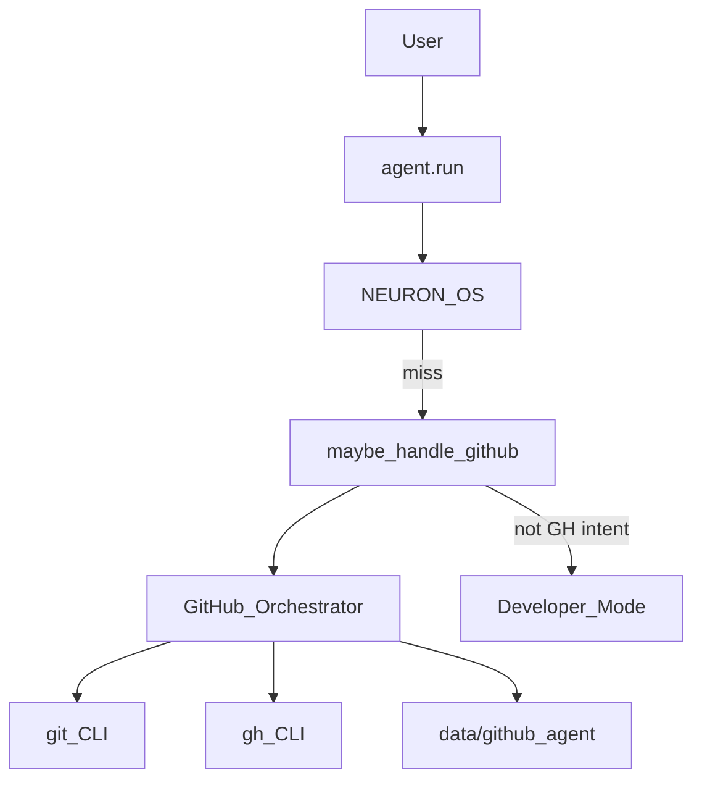

# GitHub Agent — Report

Date: 2026-08-01  
Constraints honored: existing NEURON cores (**FastIntent**, Developer Mode internals, etc.) were **not rewritten**. GitHub Agent is a compose-only layer over `git` + `gh` CLI. It is hooked **before** Developer Mode so changelog / CI / commit-review intents are handled here.

## 1. Goal

Add **GitHub intelligence**:

| Capability | Behavior |
|------------|----------|
| Repository analysis | Branch, status, recent commits, remote slug, top extensions |
| Commit review | `git show` metadata/stat + review heuristics |
| Pull request review | `gh pr view` JSON + failing checks hints |
| Merge conflict resolution | Unmerged paths + resolution advice |
| Issue generation | Draft (confirm → `gh issue create`) |
| Release notes / changelog | Grouped commits since last tag → `CHANGELOG_DRAFT.md` |
| Version tagging | Suggest next semver tag (confirm → `git tag -a`) |
| CI/CD monitoring | `gh run list` + failed log tail / explanation |

Examples: “Review my last commit.” · “Generate changelog.” · “Explain why CI failed.”

## 2. Architecture



## 3. Package

`backend/neuron/github_agent/`

| Module | Role |
|--------|------|
| `ops.py` | git/gh operations |
| `detect.py` | Intent detect/classify |
| `orchestrator.py` | Capability dispatch |
| `bridge.py` | `maybe_handle_github` |
| `types.py` | `GitHubCapability`, `GitHubResult` |

## 4. Tools

| Tool | Risk | Purpose |
|------|------|---------|
| `github_status` | safe | Remote + gh availability |
| `github_run` | confirm | Full intelligence dispatch |

```json
"agent": { "github_agent": true },
"github_agent": { "repo_path": "" }
```

## 5. Voice / text examples

| Utterance | Capability |
|-----------|------------|
| Review my last commit. | `commit_review` |
| Generate changelog. | `release_notes` |
| Explain why CI failed. | `ci_monitoring` |
| Review pull request #12 | `pr_review` |
| Resolve merge conflicts | `merge_conflicts` |
| Create an issue: flaky login | `issue_generation` (draft; confirm to create) |
| Tag a release | `version_tagging` (suggest; confirm to tag) |

## 6. Bench

```bash
cd backend
python tests/run_github_agent_bench.py
```

Result (this workspace): **PASS** — detect/classify/orchestrate/bridge/tools OK. `gh` not installed here → CI soft-fails with structured error (expected).

## 7. Non-goals

- Does not replace GitHub’s web UI for complex review discussions  
- Does not force-push or merge without explicit future confirmed tools  
- CI explanation quality depends on `gh` auth and Actions logs availability  
- Does not modify Developer Mode code — routing order prefers GitHub Agent for GH intents
