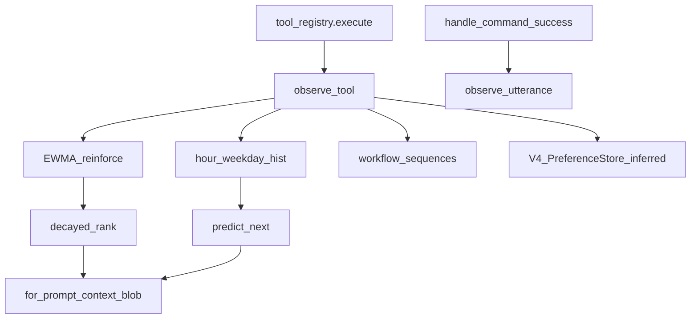

# Learning Engine — Report

Date: 2026-08-01  
Constraints: Does **not** rewrite FastIntentRouter, Semantic Understanding, Screen Understanding, Task Planning, Computer Use, or Streaming Voice. Observes their tool outcomes only.

## 1. Goal

NEURON automatically learns and ranks:

| Signal | Source tools |
|--------|----------------|
| Favorite apps | `open_app` / `focus_app` |
| Favorite websites | `open_website` / `browser_*` |
| Preferred browser | browser-named apps |
| Preferred editor | Code / Cursor / … |
| Frequently used folders | `open_folder` / `open_file` / … |
| Monitor layout | `move_window_to_monitor` |
| Repeated workflows | short successful tool sequences |
| Keyboard habits | `hotkey` / `press_keys` |
| Daily schedule | hour + weekday histograms |
| Coding habits | editor + coding utterances |

Uses **reinforcement scoring** (EWMA rewards) + **time decay** for ranking, and **habit prediction** from schedule × score.

## 2. Architecture



## 3. Scoring

- Success reward `+1.0` with α=0.25  
- Failure reward `-0.4` with α=0.15  
- Decayed rank: `score × 0.5^(days/14) × (0.7 + 0.3×success_ratio)`  
- Prediction: `0.6×decayed_score + 0.4×schedule_affinity`

## 4. Files

| File | Role |
|------|------|
| `backend/neuron/learning_engine/` | **New package** — store, scores, observe, predict, engine |
| `backend/neuron/brain/tool_registry.py` | Thin wrap of `execute` → `observe_tool` |
| `backend/brain.py` | `observe_utterance` on FastIntent success |
| `backend/neuron/brain/agent.py` | `observe_utterance` on acted `_finish` |
| `backend/memory.py` | Append `for_prompt()` into LLM context blob |
| `backend/config.json` | `agent.learning_engine: true` |
| `backend/data/learning_engine.json` | Durable scores (created at runtime) |
| `backend/tests/run_learning_engine_bench.py` | Bench harness |
| This report | Documentation |

Tool: `learning_status` — returns snapshot of favorites / predictions.

## 5. Benchmarks

| Check | Result |
|-------|--------|
| Reinforce EWMA | **OK** |
| Chrome ranked first among apps | **PASS** |
| YouTube favorite site | **PASS** |
| Preferred browser / editor | **PASS** |
| Habit predictions | **5** |
| `for_prompt` blob | **OK** |
| Observe batch | **~120 ms** (synthetic) |
| FastIntent / V4 tests | **PASS** |

## 6. Example `for_prompt` lines

```
[learning_engine]
favorite_apps: Chrome, Code, Discord
favorite_sites: youtube.com, github.com
preferred_browser: Chrome
preferred_editor: Code
frequent_folders: desktop/Projects
predict_now: app:Chrome, app:Code, folder:desktop/Projects
```

## 7. Future recommendations

1. Feed predictions into `open_app` disambiguation (“open browser” → ranked preferred browser).  
2. Wire AgentLoop goal-SUCCESS traces into workflow learning (complement V4 procedure learn).  
3. Privacy UI: list/forget learned keys.  
4. Separate coding session detector (VS Code focused duration).  
5. Push ranked habits to HierarchicalPlanner templates as soft priors.

## 8. How to run

```bash
cd backend
python tests/run_learning_engine_bench.py
```

Ask NEURON: “learning status” / tool `learning_status`.
