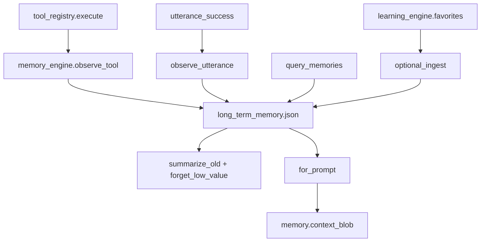

# Long-Term Memory Engine — Report

Date: 2026-08-01  
Constraints: Does not rewrite FastIntent, Screen, TaskPlan, Computer Use, or Learning Engine cores. Observes tools/utterances and extends `memory.context_blob`.

## 1. Goal

Upgrade NEURON with durable, typed long-term memory:

| Kind | Role |
|------|------|
| Episodic | What happened (commands, opens, visits) |
| Semantic | Summaries / durable facts |
| Procedural | Procedure notes (alongside existing skills) |
| Conversation | User/assistant turns worth keeping |
| Project | Workspace / project names |
| Desktop | Apps + folders in use |
| Preference | Explicit prefs + “remember forever” pins |

Also: **summarize** old memories, **forget** low-value ones, answer:

- “What project was I working on yesterday?”  
- “What folder did I use?”  
- “Remember this forever.”

## 2. Architecture



## 3. Maintenance policy

- **Summarize:** episodic/conversation older than 3 days → one semantic summary (batch of 12).  
- **Forget:** non-pinned items below value threshold after 2 days, or beyond max 800 by effective value.  
- **Pinned:** `remember forever` → preference kind, never auto-forgotten.  
- **Effective value:** `value × 0.5^(age_days/7) + access boost` (pinned → infinite keep).

## 4. Files

| File | Change |
|------|--------|
| `backend/neuron/memory_engine/` | **New** — types, store, engine, observe |
| `backend/brain.py` | NL memory queries + forever; utterance hook |
| `backend/neuron/brain/agent.py` | utterance → LTM |
| `backend/neuron/brain/tool_registry.py` | tool observe + `memory_status` |
| `backend/memory.py` | append LTM `for_prompt` |
| `backend/config.json` | `agent.long_term_memory: true` |
| `backend/data/long_term_memory.json` | runtime store |
| `backend/tests/run_memory_engine_bench.py` | benches |
| This report | Documentation |

## 5. Benchmarks

| Check | Result |
|-------|--------|
| Project yesterday query | **PASS** (NeuronAI) |
| Folder query | **PASS** |
| Remember forever | **PASS** |
| Auto summarize | **PASS** |
| `for_prompt` | **OK** |
| Learning / V4 regression | **PASS** |

## 6. Example replies

```
What project was I working on yesterday?
→ Yesterday you were on:
  - (2026-07-31 …) NeuronAI: Working on NeuronAI desktop assistant

What folder did I use?
→ Folders I remember:
  - Desktop: folder=Desktop/Projects/NeuronAI

Remember this forever: always use Chrome
→ I'll remember that forever: always use Chrome
```

## 7. Future recommendations

1. Embedding search for semantic recall (local model).  
2. Nightly maintain job instead of opportunistic `for_prompt`.  
3. User UI: list / unpin / export memories.  
4. Stronger project detection from git root / Cursor workspace.  
5. Merge explicit `memory.remember` facts into LTM semantic kind automatically.

## 8. How to run

```bash
cd backend
python tests/run_memory_engine_bench.py
```

Tool: `memory_status`. Config: `agent.long_term_memory: true`.
