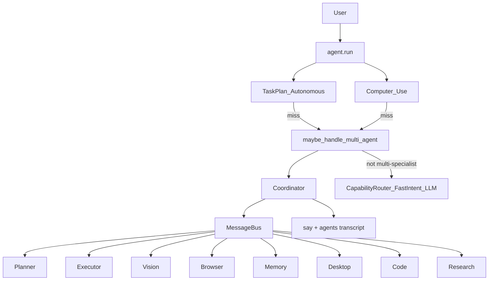

# Multi-Agent System — Report

Date: 2026-07-30  
Constraints honored: **FastIntentRouter**, **Screen Understanding**, **Computer Use**, **Task Planning / Autonomous**, **Plugin SDK**, **Workflow Recording**, **Memory**, and **Learning** cores were **not rewritten**. Specialists are thin adapters; Coordinator plugs in via `maybe_handle_multi_agent` after TaskPlan/CU.

## 1. Goal

Split NEURON into **specialized agents** that communicate:

| Agent | Responsibility |
|-------|----------------|
| **Coordinator** | Route goals, fan-out bus requests, compose replies |
| **Planner** | Goal → TaskGraph (`autonomous.plan_goal` / `build_graph`) |
| **Executor** | Run tools or autonomous workflows |
| **Vision** | Screen understanding / grounded UI |
| **Browser** | Navigate, search, tabs |
| **Memory** | Remember / query / prompt context |
| **Desktop** | Open / focus / close apps, windows |
| **Code** | VS Code / Cursor / files / folders |
| **Research** | Web research / summarize |

## 2. Architecture



**Communication:** in-process `MessageBus` — `request` / `result` / `broadcast` with correlation ids and history. Agents register handlers; Coordinator owns one user turn.

## 3. Package

`backend/neuron/agents/`

| Module | Role |
|--------|------|
| `types.py` | `AgentRole`, `AgentMessage`, `AgentResult` |
| `bus.py` | In-proc message bus |
| `base.py` | `BaseAgent` |
| `specialists.py` | Eight specialists |
| `coordinator.py` | Routing + composition + tools |
| `bridge.py` | `maybe_handle_multi_agent` |

## 4. Routing rules

- **Do not steal** Category A (`mute`, bare `Open Chrome`, …) — FastIntent keeps latency path  
- Claim when: multi-step cues, ≥2 specialist domains, research, memory+context, or explicit “multi agent”  
- Role order: Planner (if multi) → Memory / Research / Browser / Vision / Code / Desktop → Executor  
- Planned subtasks are dispatched to the specialist matching the tool domain (bus hop), else Executor  

## 5. Tools

| Tool | Risk | Purpose |
|------|------|---------|
| `multi_agent_run` | confirm | Coordinator full turn |
| `multi_agent_ask` | confirm | Direct bus ask to one role |
| `multi_agent_status` | safe | Roles + recent bus history |

## 6. Config

```json
"agent": {
  "multi_agent_system": true
}
```

Set `false` to disable the bridge (pipeline unchanged aside from missing hook).

## 7. Bench

```bash
cd backend
python tests/run_multi_agent_bench.py
```

Covers: register 8 specialists, bus request/reply, detect gates, role select, coordinator memory turn, tools, registry, bridge non-steal.

## 8. Extending

1. Subclass `BaseAgent`, set `role`, implement `handle`  
2. Add to `build_specialists()`  
3. Extend `select_roles` / `_action_to_role` as needed  

## 9. Non-goals

- Not a distributed/RPC agent mesh — same process only  
- Does not replace TaskPlan/Autonomous for classic workflows (those bridges run first)  
- Does not bypass FastIntent Category A  
- Specialists wrap existing tools; they do not reimplement Screen / Browser / Memory engines
