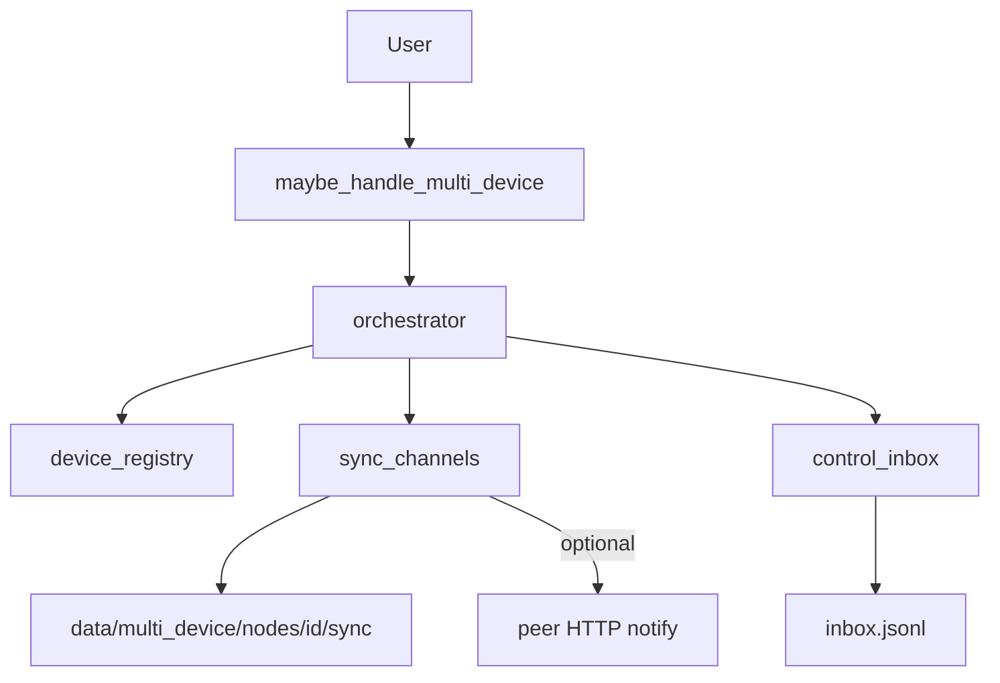

# Multi-Device — Report

Date: 2026-08-01  
Constraints honored: existing NEURON cores (Memory, Task Planner, Voice, Plugins, Project Intelligence) were **not rewritten**. Multi-Device is a compose-only layer that registers a device fleet and synchronizes channel snapshots via a local file bus (optional HTTP notify to peers).

## 1. Goal

Allow NEURON to **control multiple computers**:

| Kind | Example |
|------|---------|
| Desktop | Local workstation |
| Laptop | Portable peer |
| Remote PC | LAN/studio machine |
| VM | Virtual machine guest |
| Cloud | Cloud worker endpoint |

**Synchronize:**

| Channel | Sources |
|---------|---------|
| Memory | `data/long_term_memory.json`, `memory_store.json` |
| Tasks | `data/taskplan_state.json` |
| Voice | voice/tts config slices + `voice_recipes.json` |
| Plugins | plugin `catalog.json` + `trust.json` |
| Projects | `data/project_intelligence/*.json` |

## 2. Architecture



Local-first transport: push/pull JSON snapshots under `backend/data/multi_device/nodes/<device_id>/`. Remote peers may poll their inbox / sync folder or receive soft HTTP notify on `host:port`.

## 3. Package

`backend/neuron/multi_device/`

| Module | Role |
|--------|------|
| `identity.py` | Local device identity + paths |
| `registry.py` | Fleet register / select / seed |
| `sync.py` | Collect / snapshot / apply channels |
| `transport.py` | Push / pull / sync_all |
| `control.py` | Command envelopes to device inbox |
| `detect.py` / `orchestrator.py` / `bridge.py` | Voice + tools |

## 4. Tools / config

| Tool | Risk | Purpose |
|------|------|---------|
| `multi_device_status` | safe | Fleet + channels |
| `multi_device_run` | confirm | Register / sync / control |

```json
"agent": { "multi_device": true },
"multi_device": {
  "sync_channels": ["memory", "tasks", "voice", "plugins", "projects"],
  "default_port": 8765
}
```

## 5. Examples

| Utterance | Action |
|-----------|--------|
| List devices | Show fleet |
| Register laptop Studio | Add laptop peer |
| Sync memory | Sync memory channel to selected/peer |
| Sync all devices | Push/pull all channels across fleet |
| Control laptop: status | Enqueue command on laptop inbox |
| Switch to cloud | Select cloud device |

## 6. Bench

```bash
cd backend
python tests/run_multi_device_bench.py
```

## 7. Non-goals

- Does not replace Memory / TaskPlan / Voice / Plugin cores — only snapshots & sidecars  
- Full remote agent daemon over the network is out of scope for this layer (inbox/file bus is the contract)  
- Does not steal Category A FastIntent (`mute`, bare `Open Chrome`)  
- Voice config merge writes `synced_voice.json` sidecar to avoid clobbering full `config.json`
