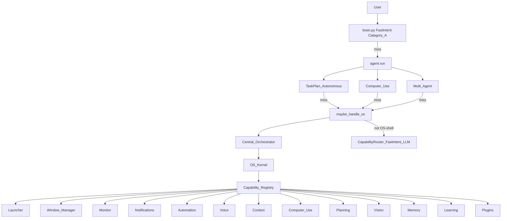

# NEURON OS — Report

Date: 2026-07-30  
Constraints honored: prior cores were **not rewritten**. NEURON OS is a compose-only operating-system layer and **central orchestration engine** over launcher, windows, monitor, notifications, automation, voice, context, computer use, planning, vision, memory, learning, and plugins.

## 1. Goal

Transform NEURON into an **OS-like desktop layer**:

| Capability | Role |
|------------|------|
| Universal launcher | Launch / focus apps (+ plugin opens) |
| Window manager | List / focus / move / min / max |
| System monitor | Processes, monitors, snapshot |
| Notification manager | Voice notify + settings entry |
| Automation hub | Workflows + task plans |
| Voice-first desktop | Hands-free / streaming status |
| Context engine | V4 context + conversation |
| Computer Use | Existing CU agent |
| AI Planning | Autonomous / TaskPlan |
| Vision | Screen understanding |
| Memory | Long-term memory engine |
| Learning | Habit / learning engine |
| Plugins | Plugin SDK inventory |

Plus a **central orchestration engine** that routes OS-shell intents to these capabilities.

## 2. Architecture



**Rule:** Never steal Category A (`mute`, bare `Open Chrome`, …) — FastIntent in `brain.py` stays first.

## 3. Package

`backend/neuron/os/`

| Module | Role |
|--------|------|
| `kernel.py` | Boot once, dispatch, session report |
| `orchestrator.py` | Central routing engine |
| `capabilities.py` | 13 capability handlers (compose) |
| `detect.py` | OS-shell detect + intent classify |
| `facade.py` | Stable APIs (`launch`, `windows`, …) |
| `bridge.py` | `maybe_handle_os` |
| `types.py` | `CapabilityId`, `OsResult`, `OsReport` |

## 4. Orchestration

1. `looks_like_os_shell(text)` — claim only OS meta intents  
2. `classify_os_intent` → capability + args  
3. `kernel.dispatch(capability, args)` → existing tool / engine  
4. Return `(say, acted, meta)` with `path=neuron_os`

Examples: `os status`, `launch Spotify`, `list windows`, `system monitor`, `list plugins`, `list workflows`, `voice status`.

Prefix form: `os vision describe the screen`, `os plan Download Blender and install it`.

## 5. Tools

| Tool | Risk | Purpose |
|------|------|---------|
| `os_status` | safe | Session + capability inventory |
| `os_run` | confirm | Orchestrate by text or `capability=` |

## 6. Config

```json
"agent": {
  "neuron_os": true
}
```

## 7. Bench

```bash
cd backend
python tests/run_neuron_os_bench.py
```

## 8. Non-goals

- Not a replacement Windows kernel / driver stack  
- Does not duplicate FastIntent, TaskPlan, CU, Multi-Agent — those bridges still run first for their domains  
- Notifications are voice/settings-backed (no new toast daemon yet)  
- OS layer adds orchestration surface area; latency Category A path unchanged
