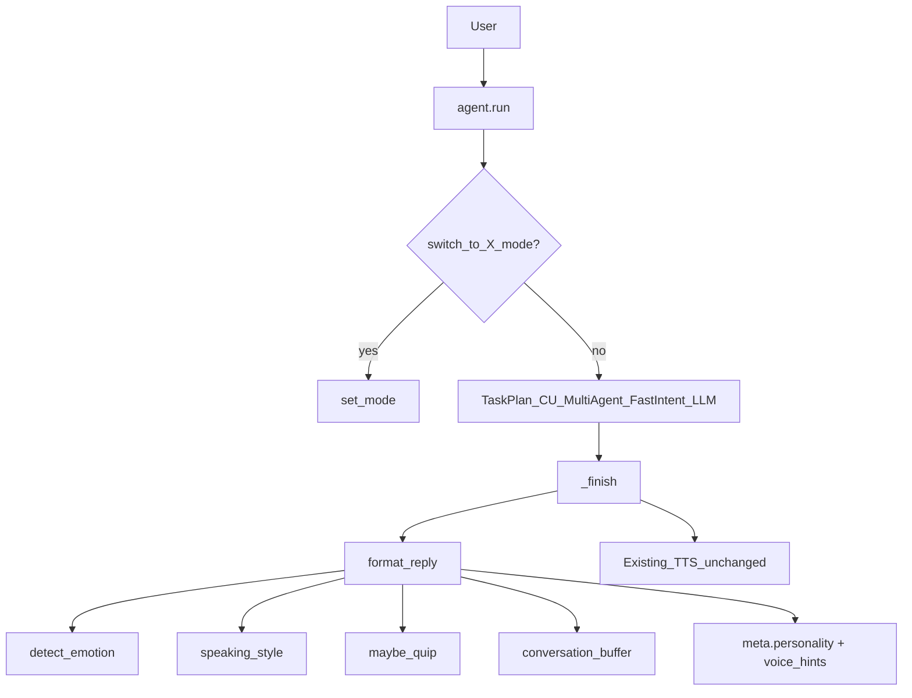

# Personality System — Report

Date: 2026-07-30  
Constraints honored: prior cores (**FastIntent**, **agents**, **memory_engine**, **TTS providers**, **TaskPlan**, **Multi-Agent**) were **not rewritten**. Personality wraps final `say` in `agent._finish` and optional mode commands at the start of `agent.run`.

## 1. Goal

Give NEURON a coherent personality layer:

| Feature | Implementation |
|---------|----------------|
| Conversation memory | Short-term turn buffer (`data/personality_conversation.json`) |
| Voice styles | Hints: calm / warm / crisp + rate bias for TTS consumers |
| Emotion detection | Lexical detector (grateful, frustrated, urgent, happy, curious, sad) |
| Speaking styles | Mode-specific rewrite/light wrap |
| Humor | Dry JARVIS quips / light friendly; gated off in professional |
| Professional mode | Formal, concise, no jokes |
| Friendly mode | Warm, encouraging, light humor |
| Iron Man JARVIS mode | Dry British wit, loyal, confident (default) |

## 2. Architecture



## 3. Package

`backend/neuron/personality/`

| Module | Role |
|--------|------|
| `modes.py` | professional / friendly / jarvis specs |
| `emotion.py` | Lexical emotion detection |
| `styles.py` | Speaking-style transforms |
| `humor.py` | Sparse quips by mode |
| `voice.py` | TTS rate/style hints |
| `buffer.py` | Conversation memory |
| `__init__.py` | `format_reply`, tools, mode commands |

## 4. Modes

| Mode | Speaking | Voice | Humor |
|------|----------|-------|-------|
| `professional` | Formal, clear | calm | none |
| `friendly` | Warm, conversational | warm | light |
| `jarvis` | Dry British JARVIS wit | crisp | dry |

Aliases: `formal`→professional, `casual`→friendly, `iron man`→jarvis.

Voice: “switch to professional mode” / `personality_set{mode}`.

## 5. Tools

| Tool | Risk | Purpose |
|------|------|---------|
| `personality_status` | safe | Mode + recent conversation |
| `personality_set` | safe | Change mode |
| `personality_detect` | safe | Emotion + voice hints |

## 6. Config

```json
"assistant": {
  "name": "NEURON",
  "mode": "jarvis",
  "personality_engine": true,
  "humor": true,
  "emotion_aware": true
}
```

`agent.personality_engine: true` feature flag.

## 7. Bench

```bash
cd backend
python tests/run_personality_bench.py
```

## 8. Non-goals

- Does not replace LLM system prompts entirely (adds optional `system_prompt_addon`)  
- Does not modify Piper/System/Browser TTS engines — emits `voice_hints` only  
- Does not invent task success (wraps existing truthful `say`)  
- Does not rewrite FastIntent or multi-agent cores
