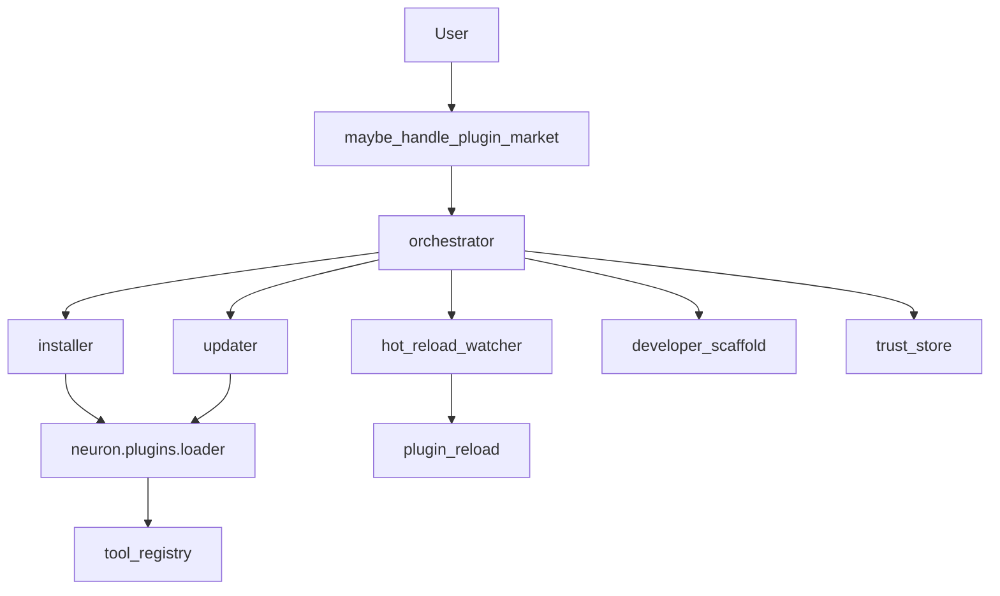

# Plugin Market — Report

Date: 2026-08-01  
Constraints honored: existing Plugin SDK (`neuron/plugins/`) was **extended**, not replaced. Builtins, loader, and `tool_registry` registration remain the core. Plugin Market is a production compose layer for install/update/hot-reload/scaffold/trust + Host API.

## 1. Goal

Ship a **production-grade Plugin SDK / Market**:

| Feature | Implementation |
|---------|----------------|
| Hot reload | `plugin_reload` + file-watch service |
| Versioning | SemVer compare + catalog upgrade plans + `api_version` |
| Permissions | Manifest risk ceiling + trust grants store |
| Dependencies | Tools / Python / plugin peers (checked on load/install) |
| Plugin API | `NeuronPluginAPI` host surface |
| Developer SDK | `scaffold()` template (plugin.json + actions.py + README) |
| Plugin installer | Folder / zip → `data/plugins/installed` + load |
| Plugin updater | Catalog vs installed version + reload/reinstall |

## 2. Architecture



## 3. Packages

| Package | Role |
|---------|------|
| `neuron/plugins/` | Core SDK (manifest, load, permissions, builtins) |
| `neuron/plugin_market/` | Market layer (install, update, watch, scaffold, API, trust) |

Artifacts under `backend/data/plugins/`:

- `installed/` — market-installed packages (auto on `plugin_roots`)
- `catalog.json` — version catalog for updater
- `trust.json` — capability grants
- `dev/` — scaffolded developer plugins

## 4. Host API (Developer SDK)

```
NeuronPluginAPI v1.0.0
- log / get_config / call_tool / list_tools
- neuron_version / has_permission / reload
```

Scaffold:

```
scaffold plugin mytool
→ data/plugins/dev/mytool/{plugin.json,actions.py,README.md,SDK.md}
```

## 5. Tools / config

| Tool | Risk | Purpose |
|------|------|---------|
| `plugin_market_status` | safe | Market status |
| `plugin_market_run` | confirm | Install/update/reload/scaffold/trust |
| `plugins_list` / `plugin_reload` / `plugin_docs` | (existing) | Core manager |

```json
"agent": { "plugin_sdk": true, "plugin_market": true },
"plugin_market": { "enabled": true, "hot_reload_interval_s": 1.5 }
```

## 6. Voice examples

- “Install plugin from folder: …”
- “Update plugins”
- “Hot reload plugins”
- “Start plugin hot reload”
- “Scaffold a plugin demo”
- “Grant plugin marketbench filesystem”

## 7. Bench

```bash
cd backend
python tests/run_plugin_market_bench.py
```

## 8. Non-goals

- No remote paid store / signing CA yet (local catalog + zip/folder install)  
- Does not rewrite FastIntent / Computer Use / Workflow Recording  
- Trust grants are advisory/store — enforce via Host API `has_permission` in plugin code  
- Builtin plugins remain thin wrappers; market installs sit beside them
