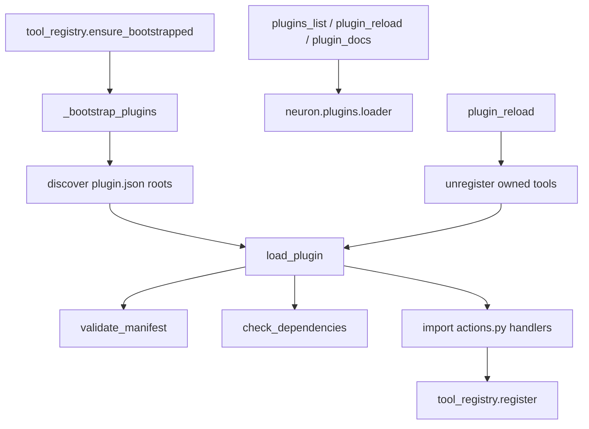

# Plugin System — Report

Date: 2026-07-30  
Constraints honored: previous systems were **not rewritten**. Plugins compose via `tool_registry.register` / `unregister` and thin wrappers over existing tools (`open_app`, `open_website`, focus helpers).

## 1. Goal

Ship a **Plugin SDK** so NEURON can extend desktop control without core rewrites:

- Actions (tools)
- Intents (phrase → preferred actions)
- Permissions (risk ceiling, control methods)
- Configuration (schema + defaults)
- Documentation (per-plugin README)
- Hot reload
- Versioning (plugin SemVer + neuron constraint)
- Dependency management (tools, python packages, other plugins)

## 2. Architecture



**Roots:** `neuron/plugins/builtin/` plus optional `config.json` → `plugins.paths`.

**Package layout:**

```
plugin_id/
  plugin.json    # manifest
  actions.py     # handlers
  README.md      # docs
```

## 3. SDK surfaces

| Feature | Where |
|---------|--------|
| Manifest types | `neuron/plugins/sdk.py` |
| Permissions / SemVer deps | `neuron/plugins/permissions.py` |
| Discover / load / unload / reload | `neuron/plugins/loader.py` |
| Public API + tools | `neuron/plugins/manager.py` |
| Registry hooks | `unregister`, `_bootstrap_plugins` in `tool_registry` |

### Actions

Each `actions[]` entry becomes a tool (`name`, optional underscore alias). Handler ref: `actions:fn_name`.

### Intents

`intents[]` with `aliases` and `prefer` action names — indexed via `loader.intents_index()` for routers / planners.

### Permissions

- `risk_ceiling`: action risk must not exceed ceiling  
- `control_methods`: e.g. `api`, `uia`  
- `planner_visible`, `allow_shell`

### Configuration

`config.schema` + `config.defaults` loaded onto `LoadedPlugin.config`.

### Documentation

`docs` field (default `README.md`); tool `plugin_docs{id}`.

### Hot reload

`plugin_reload{id}` → unload owned tools → re-import module → re-register (`overwrite=True`).

### Versioning

Plugin `version` (SemVer string). Neuron constraint via `dependencies.neuron` (e.g. `>=4.0`).

### Dependency management

- `dependencies.tools` — must exist in ToolRegistry  
- `dependencies.python` — importable packages  
- `dependencies.plugins` — other plugin ids (multi-pass load order)

## 4. Manager tools

| Tool | Risk | Purpose |
|------|------|---------|
| `plugins_list` | safe | List plugins + intent index |
| `plugin_reload` | safe | Hot-reload by id |
| `plugin_docs` | safe | Read plugin README |

## 5. Example plugins (builtin)

| Id | App | Sample actions |
|----|-----|----------------|
| chrome | Google Chrome | `chrome.open`, `chrome.new_tab`, `chrome.focus` |
| blender | Blender | open / focus / open_project |
| photoshop | Adobe Photoshop | open / focus |
| discord | Discord | open / focus / open_channel |
| steam | Steam | open / focus / goto |
| obs | OBS Studio | open / focus |
| spotify | Spotify | open / play / focus |
| office | Microsoft Office | open Word/Excel/PowerPoint |
| vscode | VS Code | open / focus / open_folder |
| cursor | Cursor | open / focus |

Handlers are thin wrappers over existing desktop tools (`open_app` / `open_website` / focus) — no duplicate OS automation stacks.

## 6. Config

```json
"plugins": {
  "enabled": true,
  "paths": []
}
```

`agent.plugin_sdk: true` marks the feature on in agent config.

## 7. Bench

```bash
cd backend
python tests/run_plugin_bench.py
```

Checks: discover 10 builtins, SemVer, load, intents, docs, hot reload, registry tools, manifest round-trip.

## 8. Extending

1. Create `my_plugin/plugin.json` + `actions.py` + `README.md`  
2. Drop under `builtin/` or add parent dir to `plugins.paths`  
3. Restart or call `plugin_reload{id}` after first load  
4. Depend on `open_app` (or other tools) in `dependencies.tools`

## 9. Non-goals / constraints

- Does **not** replace FastIntentRouter, Computer Use, Learning, or Memory cores  
- Does **not** ship native Chrome/Blender APIs — wrappers + intents for planner preference  
- Hot reload re-executes `actions.py`; in-flight tool calls are not cancelled
