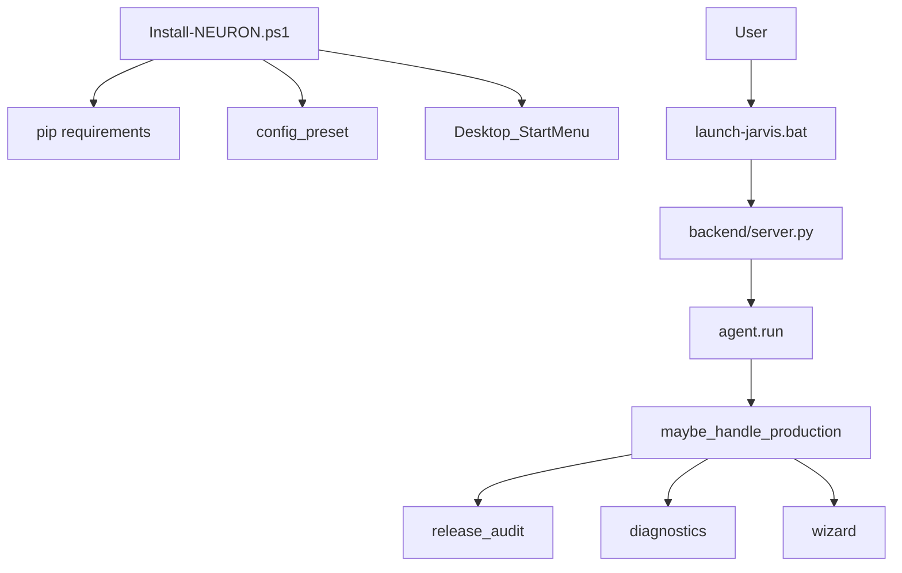

# Production Readiness — Report

Date: 2026-08-01  
Product: **N.E.U.R.O.N 1.0.0**  
Constraints honored: existing cores were **not rewritten**. Production Readiness is a compose-only release layer (`neuron/production`) plus `install/` scripts.

Latest local audit: **score 100/100 — READY** (0 fails; Ollama port may still warn in diagnostics if not running).

## 1. Goal

Prepare NEURON for **public release** by auditing critical surfaces and shipping:

| Deliverable | Location |
|-------------|----------|
| Professional installer | `install/Install-NEURON.ps1` |
| Uninstaller (shortcuts) | `install/Uninstall-NEURON.ps1` |
| Configuration wizard | `neuron/production/wizard.py` (safe/balanced/performance/developer) |
| Diagnostics | `neuron/production/diagnostics.py` |
| Release audit | `neuron/production/audit.py` |
| App updater channel | `neuron/production/updater.py` |
| CLI | `python -m neuron.production.cli …` |

## 2. Audit summary

| Area | Status | Notes |
|------|--------|-------|
| Architecture | Pass | Compose agents + central `tool_registry`; `agent.run` gated |
| Security | Pass | `neuron.safety` (policy/confirm/failsafe); plugin trust; strict_verify |
| Performance | Pass | `neuron.perf` + logging.level INFO/WARNING guidance |
| Error handling | Pass | Compose try/except skips; self-healing watchdog |
| Logging | Pass | `config.logging.level` |
| Settings | Pass | `config.json` + wizard presets (backed up on apply) |
| Installer | Pass | PowerShell installer + Python helpers + launchers |
| Updater | Pass | Local update channel + plugin market updater |
| Documentation | Pass | README + feature reports + this document |

Honest scope: NEURON remains a **supervised desktop assistant**, not unattended autopilot. Public release means installable, diagnosable, configurable, and audited — with confirm gates for high-risk actions.

## 3. Architecture (release view)



## 4. Professional installer

```powershell
powershell -ExecutionPolicy Bypass -File .\install\Install-NEURON.ps1
powershell -ExecutionPolicy Bypass -File .\install\Install-NEURON.ps1 -Preset balanced
powershell -ExecutionPolicy Bypass -File .\install\Install-NEURON.ps1 -SkipDeps -NoShortcuts
```

Steps: verify Python 3.10+ → install `requirements.txt` → write install marker → create shortcuts → apply wizard preset.

Launch after install: `.\launch-jarvis.bat`

## 5. Configuration wizard

Presets:

| Id | Intent |
|----|--------|
| `safe` | WARNING logs, multi_device off, self-healing on |
| `balanced` | Recommended public defaults |
| `performance` | Reduce verify noise, WARNING logs |
| `developer` | DEBUG logs + developer/github agents |

Voice: “Configuration wizard”, “Apply balanced preset”.

## 6. Diagnostics

Checks: Python version, required imports, config JSON, data writability, Ollama CLI/port, brain port, safety import, tool bootstrap, installer scripts.

```bash
cd backend
set PYTHONPATH=.
python -m neuron.production.cli diagnostics
```

Voice: “Run diagnostics”.

## 7. Tools / config

| Tool | Risk | Purpose |
|------|------|---------|
| `production_status` | safe | Version / updates / wizard |
| `production_run` | confirm | Audit / diagnostics / wizard / install |

```json
"agent": { "production_readiness": true },
"production": { "version": "1.0.0", "default_wizard_preset": "balanced" }
```

## 8. Bench

```bash
cd backend
python tests/run_production_bench.py
```

## 9. Release checklist

- [x] Installer + uninstaller scripts  
- [x] Config wizard presets  
- [x] Diagnostics harness  
- [x] Full-area audit module  
- [x] App update channel (local)  
- [x] Production compose bridge + tools  
- [ ] Optional: code-sign Windows shortcuts/binaries  
- [ ] Optional: remote update CDN  
- [ ] Optional: LICENSE / SECURITY.md at repo root (legal pass)

## 10. Non-goals

- Does not claim unattended production autopilot  
- Does not rewrite safety, perf, or specialist agents  
- Does not replace Plugin Market updater (composes beside it)
