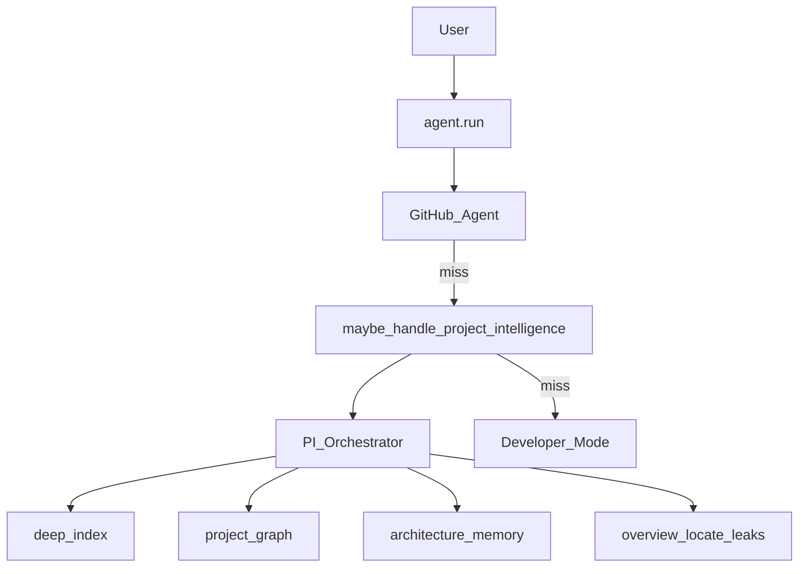

# Project Intelligence — Report

Date: 2026-08-01  
Constraints honored: existing NEURON cores (**FastIntent**, Developer Mode, GitHub Agent, etc.) were **not rewritten**. Project Intelligence is a compose-only layer. It is hooked **after** GitHub Agent and **before** Developer Mode so overview / locate / leak / graph intents are handled here.

## 1. Goal

Allow NEURON to **understand every project automatically**.

| Index | Remembers | Generates |
|-------|-----------|-----------|
| Folders | Architecture | Project graphs (Mermaid + JSON) |
| Source files | Modules | |
| Dependencies | Relationships | |
| Assets | | |
| Build outputs | | |
| Documentation | | |

Example utterances:

- “What does this project do?”
- “Where is authentication?”
- “Find memory leaks.”

## 2. Architecture



## 3. Package

`backend/neuron/project_intelligence/`

| Module | Role |
|--------|------|
| `indexer.py` | Deep scan: folders, source, deps, assets, build, docs |
| `graph.py` | Module/import/dependency graph + Mermaid export |
| `memory.py` | Persist architecture / modules / relationships |
| `query.py` | Overview, feature locate, leak heuristics, search |
| `detect.py` | Intent detect/classify |
| `orchestrator.py` | Capability dispatch |
| `bridge.py` | `maybe_handle_project_intelligence` |

Artifacts: `backend/data/project_intelligence/` (`memory_*.json`, `project_graph.mmd`, `project_graph.json`).

## 4. Tools

| Tool | Risk | Purpose |
|------|------|---------|
| `project_intel_status` | safe | Root + memory presence |
| `project_intel_run` | safe | Full intelligence dispatch |

```json
"agent": { "project_intelligence": true },
"project_intelligence": { "root": "" }
```

## 5. Voice / text examples

| Utterance | Capability |
|-----------|------------|
| What does this project do? | `overview` |
| Where is authentication? | `locate` |
| Find memory leaks. | `memory_leaks` |
| Generate project graph | `project_graph` |
| Remember this project | `architecture` |

## 6. Bench

```bash
cd backend
python tests/run_project_intelligence_bench.py
```

## 7. Non-goals / boundaries

- Does **not** replace Developer Mode build/test/refactor/git workflows  
- Reuses `developer.index.resolve_root` for workspace detection (no duplicate root logic)  
- Leak detection is **static heuristics**, not a runtime profiler  
- Does not rewrite FastIntent or steal Category A (`mute`, bare `Open Chrome`)
