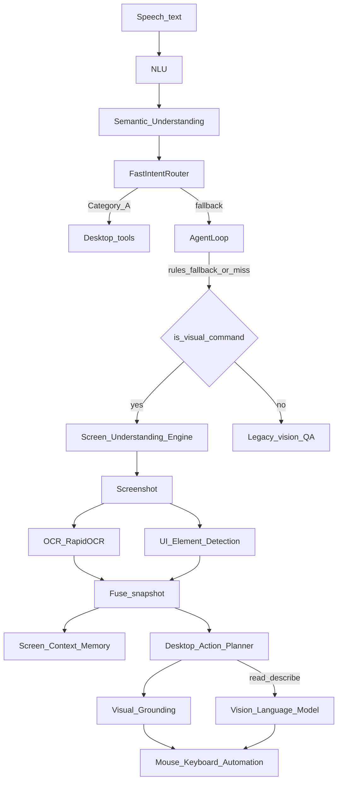

# Screen Understanding Engine — Report

Date: 2026-08-01  
Constraints honored: latency optimization, FastIntentRouter, and Semantic Understanding were **not** modified. Existing desktop automation is enhanced, not replaced.

## 1. Architecture



**Pipeline:** Desktop Screenshot → OCR → UI Element Detection → (optional) VLM → Desktop Action Planner → grounded Mouse/Keyboard automation.

Screen Understanding runs **after** AgentLoop when the planner falls through (`rules_fallback` / no action), and **before** legacy vision Q&A. Category A fast intents and semantic rewrite stay on their existing hot paths.

## 2. Capabilities

| Detected role | Source |
|---------------|--------|
| Windows / panes | UIA |
| Buttons / links | UIA + OCR fusion |
| Menus / menu items | UIA |
| Icons | UIA ImageControl + OCR |
| Input fields | UIA Edit/Document |
| Checkboxes / radios | UIA |
| Dropdowns | UIA ComboBox |
| Browser tabs | UIA TabItem |
| Taskbar / notifications | Best-effort via foreground UIA + OCR text |

**Natural commands supported (planner):** click named/colored buttons, Login, close popup, open Nth tab, reply to this message, scroll until find X, read this error, what application is open, find the download button.

**Visual grounding:** when multiple matches exist, `ground.py` ranks by name similarity, role hint, focus, window position, and last click / conversation memory.

**Context memory stores:** current window, application, focused control, detected buttons, OCR text preview, recent screenshots (last 5), last query, last click name.

## 3. Files

| File | Change |
|------|--------|
| `backend/neuron/screen/types.py` | **New** — snapshot, element, plan, result types |
| `backend/neuron/screen/detect.py` | **New** — UIA + OCR fusion |
| `backend/neuron/screen/context.py` | **New** — screen memory |
| `backend/neuron/screen/ground.py` | **New** — multi-candidate grounding |
| `backend/neuron/screen/planner.py` | **New** — visual NL → action plan |
| `backend/neuron/screen/engine.py` | **New** — observe / execute / tool handler |
| `backend/neuron/screen/__init__.py` | **New** — public API |
| `backend/brain.py` | Wire visual branch after AgentLoop, before vision Q&A |
| `backend/neuron/brain/tool_registry.py` | Register `screen_understand` tool |
| `backend/tests/run_screen_bench.py` | Classifier / planner / observe / regression checks |
| `backend/tests/screen_bench_report.json` | Measured smoke results |
| This report | Documentation |

**Untouched:** `neuron/brain/fast_router.py`, `neuron/understand/*`, latency (`perf.py` / STT / VAD) paths.

## 4. Action paths (enhance, don't replace)

1. **element_resolver** — existing DOM → UIA → OCR click cascade (preferred for named clicks)
2. **grounded_click** — click coordinates from fused snapshot when score ≥ 35
3. **vlm_computer_use** — existing `vision_agent.computer_use` fallback when grounding is weak
4. **actions.click / scroll** — existing automation primitives

## 5. Benchmarks (`run_screen_bench.py`)

Local smoke on 2026-08-01 (Cursor foreground; UIA sparse on that window):

| Metric | Result |
|--------|--------|
| Classifier accuracy (visual vs non-visual) | **100%** |
| Planner accuracy (sample commands) | **100%** |
| Screenshot latency | **~182 ms** |
| OCR latency | **~0.5 ms** (cache / empty) |
| UIA detection latency | **~4 ms** |
| Observe total | **~280 ms** |
| Action latency (describe) | **~102 ms** |
| Describe / skip non-visual | **OK** |
| FastIntentRouter untouched | **PASS** |
| False click rate | *Not measured* (needs interactive UI harness) |
| Success rate (live click suite) | *Deferred* to interactive bench |

Regression (same session):

| Suite | Result |
|-------|--------|
| `run_fast_router_bench.py` | **PASS** (Category A `agent_loop=False`) |
| `run_semantic_bench.py` | **PASS** (intent/rewrite/entity 100%) |
| `run_v4_unit_tests.py` | **PASS** (V4.0 … V4.10) |

## 6. Future recommendations

1. **Interactive success / false-click harness** — synthetic UI or Playwright fixture to measure click success and false-click rate.
2. **Taskbar / toast detectors** — dedicated Win32 / notification listeners beyond foreground UIA.
3. **Color grounding** — “blue button” via screenshot region color histograms when UIA names are empty.
4. **Optional config gate** — `agent.screen_understanding: true` for parity with semantic/fast flags.
5. **Earlier visual short-circuit** — for high-confidence visual intents, run Screen Engine before AgentLoop to cut latency on “click Login” style commands (keep FastIntent Category A untouched).
6. **VLM only when needed** — keep describe-app on UIA-only path (already); expand heuristics to avoid VLM on simple named clicks.

## 7. How to run

```bash
cd backend
python tests/run_screen_bench.py
python tests/run_fast_router_bench.py
python tests/run_semantic_bench.py
```
