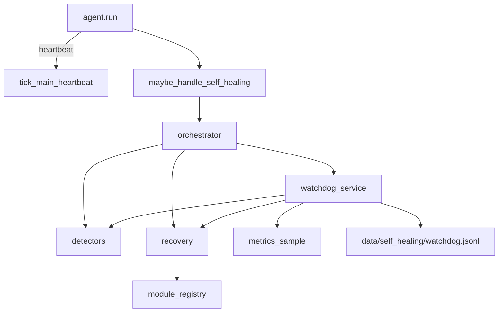

# Self-Healing — Report

Date: 2026-08-01  
Constraints honored: existing NEURON cores were **not rewritten**. Self-Healing is a compose-only layer (metrics → detectors → recovery → watchdog) hooked into `agent.run` after Project Intelligence and before Developer Mode. Static “Find memory leaks.” remains Project Intelligence; this layer owns **runtime** process health.

## 1. Goal

Detect and automatically recover from:

| Fault | Detection |
|-------|-----------|
| Crash | Registered module crash log / restart failures |
| Freeze | Stale main-loop heartbeat age |
| Memory leak | Monotonic RSS growth across samples |
| Deadlock | Stale heartbeat + near-idle CPU |
| High CPU | Process CPU ≥ threshold |
| High RAM | Process RSS ≥ threshold |

Also: **restart failed modules**, **watchdog service**, voice/tool control.

## 2. Architecture



## 3. Package

`backend/neuron/self_healing/`

| Module | Role |
|--------|------|
| `metrics.py` | CPU/RAM/threads (+ optional psutil) |
| `detectors.py` | Fault heuristics |
| `recovery.py` | Soft module restarts + GC/cache clear |
| `watchdog.py` | Background poll + auto-recover |
| `detect.py` | Voice/text intent |
| `orchestrator.py` | Capability dispatch |
| `bridge.py` | `maybe_handle_self_healing` |

Restartable modules (soft): `gc`, `project_intelligence`, `developer_index`, `tool_registry`, `metrics_history`.

## 4. Tools / config

| Tool | Risk | Purpose |
|------|------|---------|
| `self_heal_status` | safe | Watchdog + modules |
| `self_heal_run` | confirm | Scan / recover / watchdog / restart |

```json
"agent": { "self_healing": true },
"self_healing": {
  "auto_start_watchdog": false,
  "interval_s": 2.0,
  "thresholds": { "cpu_percent": 85.0, "ram_mb": 1500.0 }
}
```

## 5. Examples

| Utterance | Action |
|-----------|--------|
| Start the watchdog | Begin background monitor + auto-recover |
| System health | One-shot fault scan |
| Restart failed modules | Bounce crashed/soft modules |
| High CPU / High RAM | Scan (+ recover when classified) |
| Enable self-heal | Alias for watchdog start |

## 6. Bench

```bash
cd backend
python tests/run_self_healing_bench.py
```

## 7. Non-goals

- Does not kill/relaunch the OS process unless extended later (soft recovery only)  
- Does not steal Project Intelligence static leak scans  
- Freeze/deadlock accuracy depends on `agent.run` calling the heartbeat  
- Thresholds are configurable; defaults are conservative for a desktop assistant
