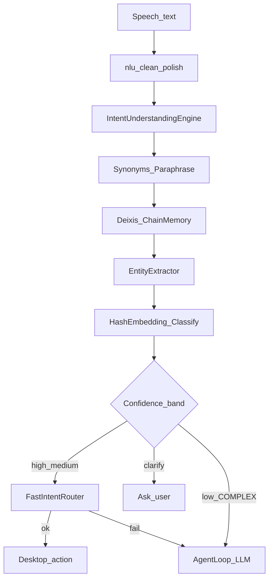

# Semantic Intent Understanding — Report

Date: 2026-08-01  
Constraint honored: FastIntentRouter + latency work + AgentLoop all preserved.

## 1. Architecture

Semantic layer **rewrites** natural language into canonical commands.  
**FastIntentRouter remains the primary executor.**

## 2. Files

| File | Change |
|------|--------|
| `backend/neuron/understand/` | **New package** — engine, embeddings, synonyms, entities, context memory |
| `backend/brain.py` | Call `understand_for_router` before FastIntentRouter; remember success |
| `backend/config.json` | `agent.semantic_understanding: true` |
| `backend/tests/run_semantic_bench.py` | Accuracy + latency benchmarks |
| `backend/tests/semantic_bench_report.json` | Measured results |
| This report | Documentation |

## 3. Before vs after examples

| User says | Before | After rewrite → Fast path |
|-----------|--------|---------------------------|
| Open the browser. | often miss / LLM | `open chrome` |
| Can you launch Chrome? | sometimes OK via NLU | `open chrome` |
| I need Google. | weak | `open google` |
| Let's browse. | miss | `open chrome` |
| Take me to YouTube. | miss | `open youtube` |
| Search for Blender tutorials. (after YT) | bare search | `search youtube for blender tutorials` |
| close that (Chrome focused) | ambiguous | `close chrome` |
| summarize this document | risk of false desktop | COMPLEX → AgentLoop |

## 4. Benchmarks (`run_semantic_bench.py`)

| Metric | Result |
|--------|--------|
| Intent accuracy | **100%** |
| Rewrite accuracy | **100%** |
| Entity accuracy | **100%** |
| False positives (complex→desktop) | **0** |
| Chain / deixis | **OK** |
| FastIntentRouter still OK | **PASS** |
| Understanding latency mean | **0.77 ms** (max 6 ms) |

Fast-router bench still passes (`used_agent_loop=False` on Category A).  
V4 unit tests: **ALL PASSED**.

## 5. Confidence bands

| Band | Action |
|------|--------|
| high (≥0.82) | Rewrite → FastIntentRouter |
| medium (0.55–0.82) | Rewrite try Fast path; clarify if app missing |
| low / COMPLEX | Leave text; AgentLoop / LLM |

## 6. Performance note

No new ML package. Embeddings are local hashed n-grams (numpy only).  
Mean understanding overhead ≪ 1 ms after first call — does not undo FastIntentRouter gains.

## 7. Future recommendations

1. Optional `sentence-transformers` mini model behind a flag for richer paraphrase (keep hash path default).  
2. Learn user aliases (“my editor” → Cursor) into `DesktopMemory`.  
3. Expand site/app entity lexicon from `pc_inventory.json`.  
4. Multi-clause chaining (“open chrome and go to youtube”) as ordered FastIntent steps.
