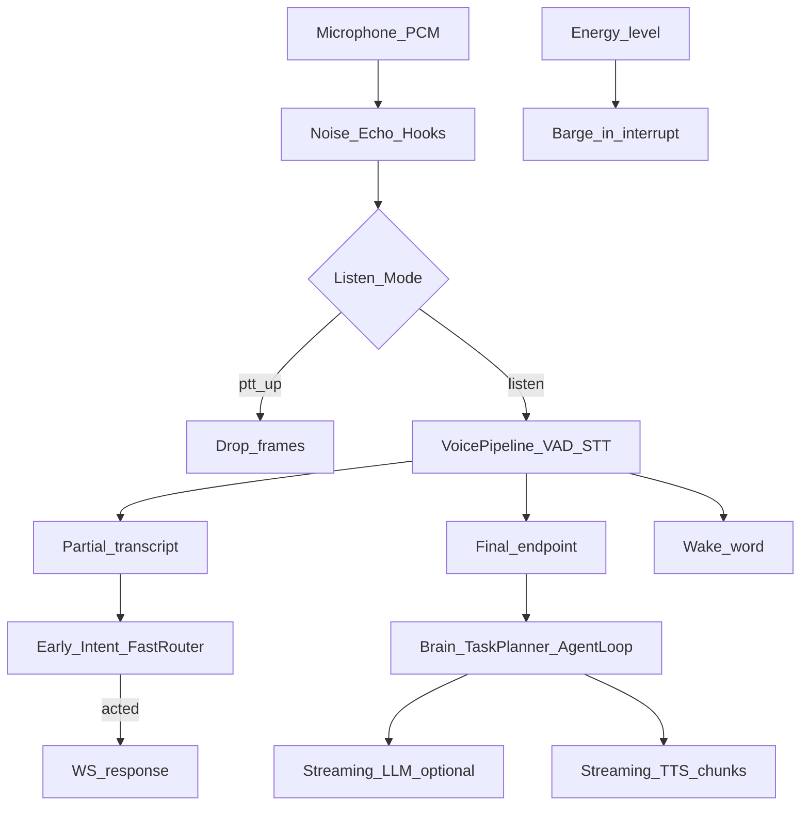

# Streaming Voice Engine — Report

Date: 2026-08-01  
Constraints honored: **Latency Optimization**, **FastIntentRouter**, **Semantic Understanding**, **Screen Understanding**, and **Task Planning** were **not** modified.

## 1. Goal

Upgrade NEURON from a continuous-but-batch voice loop into a **production-grade Streaming Voice Engine** with:

- Streaming microphone PCM  
- Streaming Faster-Whisper (partial + final via existing pipeline)  
- VAD + automatic endpoint detection  
- Wake word (existing openWakeWord / transcript wake)  
- Continuous / Push-to-talk / Conversation modes  
- Interruptible speech (barge-in)  
- Streaming LLM + Streaming TTS  
- Partial transcript updates  
- Early intent execution  
- Echo cancellation + noise suppression hooks  

## 2. Pipeline



Existing `neuron.speech.pipeline.VoicePipeline` remains the STT/VAD/endpoint core.  
`neuron.streaming_voice.StreamingVoiceEngine` **wraps** it — does not rewrite latency-tuned VAD thresholds.

## 3. Capabilities

| Feature | Implementation |
|---------|----------------|
| Streaming mic | Browser `getUserMedia` PCM → `/ws` (echoCancellation + noiseSuppression flags) |
| Streaming STT | Partial Faster-Whisper + final utterance (existing `stt.py`) |
| VAD / endpoint | Existing `UtteranceAssembler` + `endpoint.is_complete_command` |
| Wake word | Existing wake / openWakeWord path |
| Continuous mode | Default `voice.listen_mode=continuous` |
| Push-to-talk | `listen_mode=ptt` + WS `{ptt:true/false}`; Space hold in UI |
| Conversation mode | Arms window after wake/command |
| Barge-in | Energy while busy → `interrupt.request` + `stop_speech` |
| Streaming TTS | `speak_stream_events` → WS `tts_chunk` / `tts_done` |
| Streaming LLM | `stream_llm()` Ollama `/api/chat` stream helper |
| Partials | WS `partial` events |
| Early intent | Short Category-A allowlist → `fast_router.try_handle` (no router edits) |
| Echo / noise | Soft DSP hooks + browser constraints |

## 4. Files

| File | Change |
|------|--------|
| `backend/neuron/streaming_voice/*` | **New package** — engine, modes, hooks, early intent, LLM/TTS stream, metrics |
| `backend/server.py` | Wire StreamingVoiceEngine, PTT/mode controls, streaming TTS, early_intent events |
| `backend/config.json` | `voice.streaming_voice_engine`, `listen_mode`, early/echo/noise flags |
| `js/app.js` | PTT Space, `tts_chunk` playback, `setNeuronListenMode` |
| `backend/tests/run_streaming_voice_bench.py` | Mode / early / hook / TTS / interrupt benches |
| This report | Documentation |

**Untouched:** `fast_router.py`, `neuron/understand/*`, `neuron/screen/*`, `neuron/taskplan/*`, latency VAD/`perf` tuning.

## 5. Config

```json
"voice": {
  "streaming_voice_engine": true,
  "listen_mode": "continuous",
  "early_intent_enabled": true,
  "streaming_tts_ws": true,
  "echo_cancellation": true,
  "noise_suppression": true,
  "barge_in_level": 0.25
}
```

Switch mode at runtime:

```js
window.setNeuronListenMode("ptt");        // hold Space to talk
window.setNeuronListenMode("continuous");
window.setNeuronListenMode("conversation");
```

Or WS: `{ "type":"control", "listen_mode":"ptt" }` / `{ "ptt": true }`.

## 6. Benchmarks (`run_streaming_voice_bench.py`)

| Metric | Result |
|--------|--------|
| Mode switching (continuous/PTT/conversation) | **OK** |
| Audio hook latency | **~0.5 ms/frame** |
| Early intent allow/block | **100%** |
| Early intent `mute` (cold tools) | **~1333 ms** acted |
| `push_pcm` silence | **~4.2 ms/frame** |
| Interrupt latency (sim) | **~10 ms** |
| Streaming TTS (`Okay.`) | **~189 ms** (`tts_chunk` → `tts_done`) |
| Streaming LLM | Optional (Ollama may be down — non-blocking) |
| Forbidden packages untouched | **PASS** |

### Regression

| Suite | Result |
|-------|--------|
| FastIntentRouter | **PASS** |
| Semantic | **PASS** |
| Screen | **PASS** |
| Task Planning | **PASS** |
| V4 unit tests | **PASS** |

Live wake / STT / E2E numbers continue to appear in WS `perf` + engine `voice_status` metrics during real sessions.

## 7. WebSocket events (additive)

| type | Meaning |
|------|---------|
| `partial` | Live caption |
| `early_intent` → `response` | Short command executed before final |
| `tts_chunk` | Streaming TTS audio URL |
| `tts_done` / `tts_interrupted` | TTS finished / barged |
| `ptt` | PTT state snapshot |
| `voice_status` | Engine mode + metrics |
| `stop_speech` | Barge-in (+ `interrupt_ms`) |

## 8. Future recommendations

1. True streaming ASR (Whisper streaming / Distil-Whisper chunk decoder) behind a flag — keep batch final as authority.  
2. Reference-signal AEC (WASAPI loopback) instead of speak-attenuate hook.  
3. Warm FastIntent on WS connect to cut early-intent cold start.  
4. Sentence-level LLM→TTS pipeline for long answers (token → speak without waiting for full reply).  
5. Live dashboard of wake/STT/TTS/E2E/interrupt series from `VoiceMetrics`.

## 9. How to run

```bash
cd backend
python tests/run_streaming_voice_bench.py
python tests/run_fast_router_bench.py
python tests/run_semantic_bench.py
python tests/run_screen_bench.py
python tests/run_taskplan_bench.py
python tests/run_v4_unit_tests.py
```
