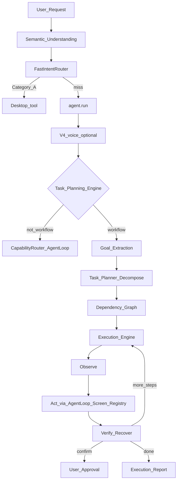

# Task Planning Engine — Architecture Report

Date: 2026-08-01  
Constraints honored: **Latency optimization**, **FastIntentRouter**, **Semantic Understanding**, and **Screen Understanding** were not modified. Existing capabilities and performance paths preserved.

## 1. Goal

Transform NEURON from single-command execution into an autonomous multi-step desktop agent that can **plan → execute → observe → verify → recover → complete** workflows across apps, while composing (not rewriting) FastIntent, Screen Understanding, OCR, automation, browser tools, vision, memory, and AgentLoop.

## 2. Architecture



### Pipeline (implemented)

User Request → Goal Extraction → Task Planner → Subtask Generator → Dependency Graph → Execution Engine → Observation → Verification / Recovery → continue until goal completed (or confirm / cancel / fail).

### Composition (call, don’t rewrite)

| Capability | How TaskPlan uses it |
|------------|----------------------|
| FastIntentRouter | Unchanged; Category A still wins in `brain.py` before AgentLoop |
| Semantic Understanding | Unchanged; rewrites feed `resolved_request` into the bridge |
| Screen Understanding | Invoked via `screen_understand` / `neuron.screen.handle` for visual subtasks |
| AgentLoop / OPAVR | Preferred executor for each subtask (verify + recover) |
| ToolRegistry | Direct fallback + `run_task_workflow` / file helpers |
| multi_app | Bridged when templates miss (`compose_multi_app_plan`) |
| Safety policy | Confirm gate before destructive / confirm-tier tools |

## 3. Supported example plans

| Request | Template | Steps (approx.) |
|---------|----------|-----------------|
| Download Blender and install it | `template:blender_download` | Chrome → blender.org → screen Download → confirm Install |
| Open Chrome, search YouTube for Unreal…, play first | `template:youtube` | open_app → browser_search → play_result |
| Open VS Code, create Python Hello World, run it | `template:vscode_hello` | open Code → create_file → open_file → terminal → type run |
| WhatsApp Web reply then archive | `template:whatsapp` | open_website → screen reply → screen archive (confirm) |
| Desktop Projects folder, move PDFs, zip | `template:desktop_projects` | create_folder → task_move_files → task_zip_folder (confirm) |

Generic clause decomposition and `multi_app` fill gaps when no template matches.

## 4. Execution features

| Feature | Implementation |
|---------|----------------|
| Goal extraction | `extract.py` → `GoalSpec` (apps, criteria, destructive flag) |
| Task decomposition | Templates + multi_app + generic clauses |
| Dependency resolution | `depends_on` + Kahn topological order / ready-set |
| Progress tracking | `TaskState` (completed / failed / pending / current) |
| Retry logic | Per-subtask `max_attempts` (default 3) |
| Error recovery | `neuron.brain.recover.deterministic_recovery` alternate actions |
| Avoid endless identical failure | Signature compare; skip repeat of same failing action |
| Resume interrupted tasks | In-memory + `data/taskplan_state.json`; “resume” / “continue” |
| Safe cancellation | “cancel” / speech interrupt → `TaskStatus.CANCELLED` |
| User approval | `requires_confirm` + safety policy → pause + “Say confirm” |

### Execution state remembered

- Current task / goal  
- Completed, failed, pending steps  
- Current application / focused window  
- Recent observations  
- Retry + recovery counts  
- Pending confirm payload  

## 5. Files

| File | Change |
|------|--------|
| `backend/neuron/taskplan/types.py` | **New** — Goal, Subtask, TaskGraph, TaskState, ExecutionReport |
| `backend/neuron/taskplan/detect.py` | **New** — workflow / cancel / resume / confirm detectors |
| `backend/neuron/taskplan/extract.py` | **New** — goal extraction |
| `backend/neuron/taskplan/decompose.py` | **New** — templates + multi_app + generic planner |
| `backend/neuron/taskplan/observe.py` | **New** — lightweight observe via world/screen memory |
| `backend/neuron/taskplan/state.py` | **New** — progress + persistence |
| `backend/neuron/taskplan/file_ops.py` | **New** — move/zip helpers for desktop workflows |
| `backend/neuron/taskplan/engine.py` | **New** — execution engine + report |
| `backend/neuron/taskplan/bridge.py` | **New** — `maybe_handle_taskplan` for agent.run |
| `backend/neuron/taskplan/__init__.py` | **New** — public API |
| `backend/neuron/brain/agent.py` | Hook after voice, before CapabilityRouter |
| `backend/neuron/brain/tool_registry.py` | Register `run_task_workflow`, `task_move_files`, `task_zip_folder` |
| `backend/config.json` | `agent.task_planning_engine: true` |
| `backend/tests/run_taskplan_bench.py` | Planner / detect / deps / confirm / cancel benches |
| This report | Documentation |

**Untouched:** `fast_router.py`, `neuron/understand/*`, `neuron/screen/*`, latency/`perf` paths.

## 6. Routing order (unchanged prefixes)

```
NLU → Semantic → FastIntent (Category A)
  → AgentLoop entry (agent.run)
      → V4 voice (opt-in)
      → Task Planning Engine (multi-step only)
      → CapabilityRouter / Fast fallback / OPAVR
  → Screen Understanding (visual single cmds)
  → Vision Q&A / legacy
```

Single commands like `mute` / `Open Chrome` are **not** claimed by TaskPlan.

## 7. Benchmarks (`run_taskplan_bench.py`)

| Metric | Result |
|--------|--------|
| Workflow detect accuracy (5 samples) | **100%** |
| Plan accuracy (templates) | **100%** |
| Non-workflow skip (mute/volume/open/undo) | **100%** |
| Dependency order | **OK** |
| Confirm gate (desktop Projects) | **OK** |
| Cancel with no task | **OK** |
| Mean planner latency | **~0.16 ms** |
| Fast / Semantic / Screen packages present | **OK** |

### Regression (same session)

| Suite | Result |
|-------|--------|
| `run_fast_router_bench.py` | **PASS** (Category A, no AgentLoop) |
| `run_semantic_bench.py` | **PASS** |
| `run_screen_bench.py` | **PASS** |
| `run_v4_unit_tests.py` | **PASS** (V4.0 … V4.10) |

Live **task completion time / success rate / retry / recovery / execution latency** on real GUIs are emitted in `ExecutionReport` at runtime (`meta.report`); interactive harness recommended for continuous metrics.

## 8. Execution report fields

Each run returns `meta.report` with:

- `completion_ms`, `planner_ms`, `execution_ms`  
- `success`, `steps_total` / `completed` / `failed`  
- `retry_count`, `recovery_count`  
- `cancelled`, `needs_confirm`  
- Subtask snapshots + recent observations  

## 9. Future recommendations

1. Interactive workflow harness (YouTube / files) for success & recovery rates.  
2. LLM fallback decomposition when templates + generic miss (via existing `brain.planner`, gated).  
3. Parallel ready-set execution where dependencies allow (today sequential for safety).  
4. Richer WhatsApp / installer verify criteria via Screen Understanding snapshots.  
5. Optional shadow mode: plan-only logging without mutation for new templates.

## 10. How to run

```bash
cd backend
python tests/run_taskplan_bench.py
python tests/run_fast_router_bench.py
python tests/run_semantic_bench.py
python tests/run_screen_bench.py
python tests/run_v4_unit_tests.py
```

Config gate: `agent.task_planning_engine` (default `true`).
