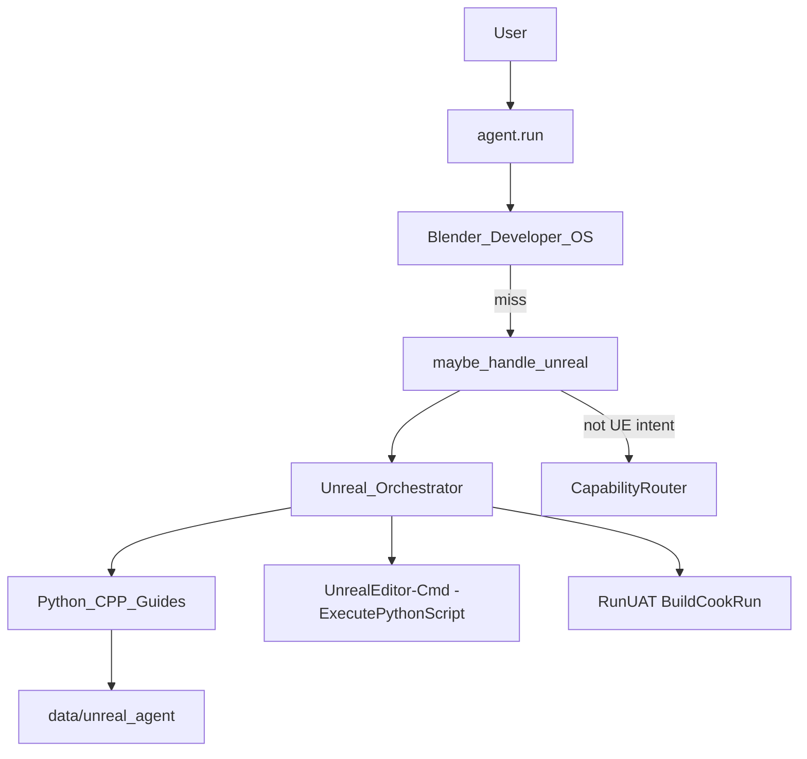

# Unreal Agent — Report

Date: 2026-07-30  
Constraints honored: existing NEURON cores were **not rewritten**. Unreal Agent is a compose-only expert that generates **Unreal Editor Python**, **C++ stubs**, packaging/UAT plans, and crash analyses under `backend/data/unreal_agent/`.

## 1. Goal

Make NEURON an **Unreal Engine expert** for:

| Area | Support |
|------|---------|
| Blueprints | Guides + Character BP scaffold via Editor Python |
| C++ | Actor / Character header+cpp stubs |
| Materials | Material asset factory script |
| Niagara | Fire system scaffold + emitter guide |
| Landscape | Creation/sculpt checklist |
| Animation | AnimBP / retarget notes |
| Sequencer | Level Sequence asset script |
| Lighting | Directional light spawn + Lumen notes |
| Optimization | FPS playbook (`stat unit`, Nanite, VSM, …) |
| Packaging | `RunUAT BuildCookRun` plan (+ optional execute) |
| Build monitoring | UBT / Live Coding / ShaderCompileWorker checklist |
| Crash analysis | Fatal/Assert/Log Error parsing |

Examples: “Create a third-person character.” · “Generate a Niagara fire effect.” · “Optimize FPS.” · “Package the game.”

## 2. Architecture



## 3. Package

`backend/neuron/unreal_agent/`

| Module | Role |
|--------|------|
| `recipes.py` | Editor Python, C++ stubs, packaging/crash/optimize |
| `runner.py` | Find Engine / EditorCmd / UAT / `.uproject` |
| `detect.py` | Intent detect/classify |
| `orchestrator.py` | Capability dispatch |
| `bridge.py` | `maybe_handle_unreal` |
| `types.py` | `UnrealCapability`, `UnrealResult` |

## 4. Tools

| Tool | Risk | Purpose |
|------|------|---------|
| `unreal_status` | safe | Engine, EditorCmd, UAT, project |
| `unreal_run` | confirm | Full expert dispatch |

Config:

```json
"agent": { "unreal_agent": true },
"unreal_agent": { "engine_path": "", "project_path": "" }
```

## 5. Bench

```bash
cd backend
python tests/run_unreal_agent_bench.py
```

## 6. Non-goals

- Does not replace Unreal Editor UI for complex Blueprint graphs  
- Does not modify FastIntent, Task Planner, Computer Use, Blender Agent, or Developer Mode cores  
- Packaging execute requires confirm + working RunUAT  
- If Engine is missing, artifacts are still written (dry-run) for later use in Editor
