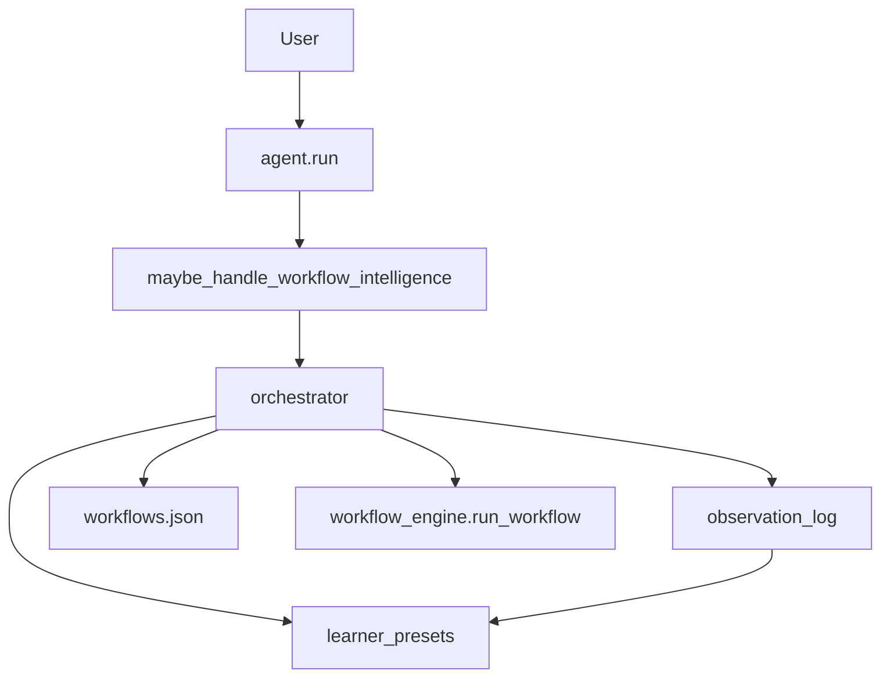

# Workflow Intelligence — Report

Date: 2026-08-01  
Constraints honored: existing **Workflow Recording** (`neuron/workflows/`) was **not rewritten**. Workflow Intelligence is a compose-only layer that observes app surfaces, learns reusable workflows into the same `workflows.json` store, and runs voice presets.

## 1. Goal

Allow NEURON to **learn workflows** by observing:

| Surface | Action |
|---------|--------|
| Cursor | open / focus |
| GitHub | browser → github.com |
| Blender | open |
| Unreal | open UnrealEditor |
| VS Code | open Code |
| Browser | open Chrome |

Automatically create **reusable workflows**, then run them from phrases like:

- “Start game development.”
- “Start coding.”
- “Prepare for Blender.”

## 2. Architecture



## 3. Package

`backend/neuron/workflow_intelligence/`

| Module | Role |
|--------|------|
| `apps.py` | Cursor / GitHub / Blender / Unreal / VS Code / Browser targets |
| `observe.py` | JSONL observation log |
| `learner.py` | Presets + auto-learn → `store.save` |
| `detect.py` | Intent detect/classify |
| `orchestrator.py` | Dispatch observe/learn/run |
| `bridge.py` | `maybe_handle_workflow_intelligence` |

Artifacts: `backend/data/workflow_intelligence/observations.jsonl` + workflows tagged `workflow_intelligence` in `backend/data/workflows.json`.

## 4. Seed presets

| Preset | Apps |
|--------|------|
| Start Game Development | Unreal → Cursor → GitHub |
| Start Coding | Cursor → VS Code → Browser → GitHub |
| Prepare for Blender | Blender → Browser |

Learning merges recent observations into a new tagged workflow, or refreshes a matching preset.

## 5. Tools / config

| Tool | Risk | Purpose |
|------|------|---------|
| `workflow_intel_status` | safe | Presets + recent apps |
| `workflow_intel_run` | confirm | Observe / learn / run presets |

```json
"agent": { "workflow_intelligence": true },
"workflow_intelligence": {
  "observe_apps": ["cursor", "github", "blender", "unreal", "vscode", "browser"]
}
```

## 6. Bench

```bash
cd backend
python tests/run_workflow_intelligence_bench.py
```

Preset runs in the bench use `dry_run=True` so apps are not launched.

## 7. Non-goals

- Does not replace low-level mouse/keyboard recording (`neuron/workflows/recorder`)  
- Does not rewrite Learning Engine / V4 procedures  
- Bare `Open Chrome` stays FastIntent (not stolen)  
- Unreal/GitHub Desktop resolution depends on local install + `open_app` aliases
