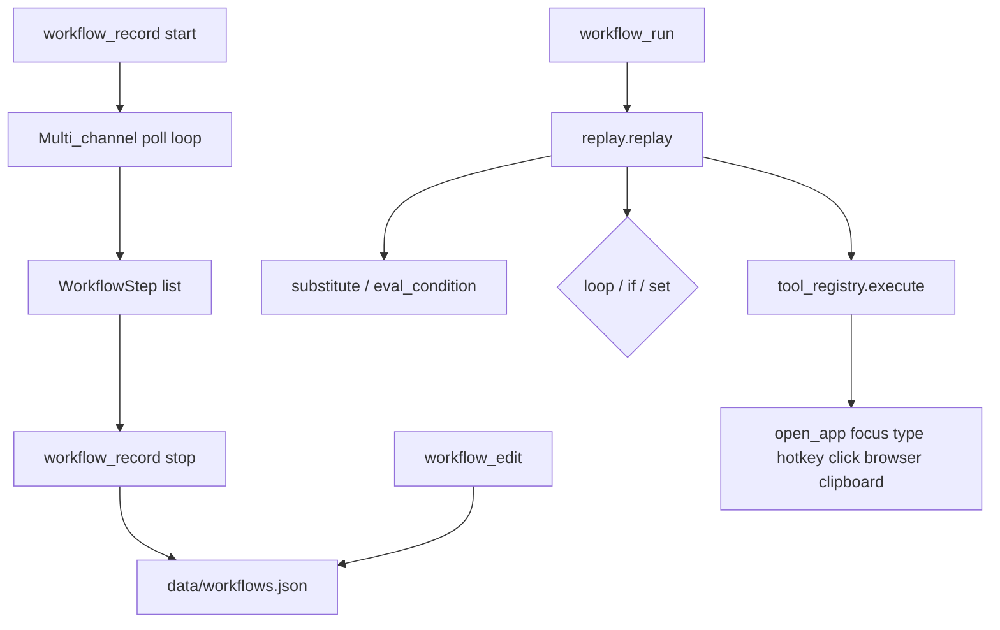

# Workflow Recording — Report

Date: 2026-07-30  
Constraints honored: previous systems were **not rewritten**. Workflows compose via `tool_registry` tools and existing input/browser/app executors. Click-recorder and procedure learning remain intact.

## 1. Goal

Implement **Workflow Recording** so NEURON can capture, edit, and replay multi-channel desktop workflows:

| Channel | Capture |
|---------|---------|
| Mouse | Left/right clicks + UIA element identity + coords |
| Keyboard | Typed bursts, keys, hotkeys |
| Applications | App switches (`app` / `focus` steps) |
| Clipboard | Clipboard text changes |
| Browser | Best-effort URL from Chrome/Edge title or address bar |
| Timing | Idle gaps → `wait` steps |
| Window focus | Foreground app + title |

Also support: **replay**, **editing**, **variables**, **loops**, **conditions**.

## 2. Architecture



**Package:** `backend/neuron/workflows/`

| Module | Role |
|--------|------|
| `types.py` | `Workflow`, `WorkflowStep` |
| `store.py` | JSON persistence |
| `recorder.py` | Multi-channel recording thread |
| `vars.py` | `{{var}}` + safe conditions |
| `replay.py` | Execution + control flow |
| `editor.py` | CRUD steps / vars / loops / ifs |
| `engine.py` | Tools + public API |

## 3. Step kinds

| Kind | Args (main) | Notes |
|------|-------------|--------|
| `mouse` | button, x, y, element | Prefers UIA name click, else coords |
| `key` | key | `press_key` |
| `hotkey` | keys | `hotkey` |
| `type` | text | Supports `{{vars}}` |
| `app` | name | `open_app` |
| `focus` | app, title | `focus_app` |
| `clipboard` | op=set\|get, text, as | Win32 clipboard |
| `browser` | url | `browser_navigate` / `open_website` |
| `wait` | ms / seconds | Timing |
| `tool` | tool, args | Arbitrary registry tool |
| `set` | name, value | Runtime / workflow variables |
| `loop` | count / while, as | Nested `steps` |
| `if` | when | `steps` / `else_steps` |

## 4. Variables, loops, conditions

- **Variables:** workflow defaults + runtime overrides; strings use `{{name}}`.
- **Loops:** `count` / `times` (resolves `{{n}}`) or `while` expression with `max` guard; optional `as` index variable.
- **Conditions:** `true`/`false`, comparisons (`== != > < >= <=`), `empty` / `not empty`, truthy substituted values.

## 5. Tools

| Tool | Risk | Purpose |
|------|------|---------|
| `workflow_record` | safe | `action=start\|stop\|cancel\|status` |
| `workflow_list` | safe | List saved workflows |
| `workflow_run` | confirm | Replay (`dry_run`, `variables`) |
| `workflow_edit` | safe | create / get / steps / vars / add_loop / add_condition / … |

## 6. Config

```json
"workflows": {
  "enabled": true,
  "max_steps": 80,
  "poll_seconds": 0.05,
  "idle_wait_ms": 800,
  "channels": ["mouse","keyboard","applications","clipboard","browser","timing","window_focus"]
}
```

`agent.workflow_recording: true` feature flag.

Store default: `backend/data/workflows.json`.

## 7. Bench

```bash
cd backend
python tests/run_workflow_bench.py
```

Covers: variable substitution, conditions, editor loops/ifs, dry replay, wait replay, tool registration.

## 8. Extending

1. Record: `workflow_record{action:start, name:"Daily standup"}` → perform task → `action:stop`  
2. Edit: `workflow_edit{action:add_loop, id:…, count:3}` or `add_condition` with `when`  
3. Parameterize: `set_variables` + `{{url}}` in browser/type steps  
4. Replay: `workflow_run{id:…, variables:{url:"…"}}`

## 9. Non-goals / constraints

- Does **not** replace `click_recorder` or V4 procedure learning  
- Does **not** rewrite FastIntentRouter, Computer Use, Plugin SDK, Memory, or Learning Engine  
- Live recording of loops/conditions is via **edit** after capture (control-flow is authored)  
- Browser URL capture is best-effort (UIA / title); prefer explicit `browser` steps when editing
